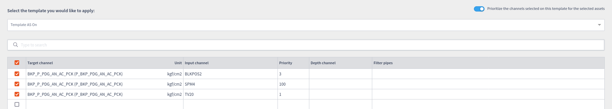
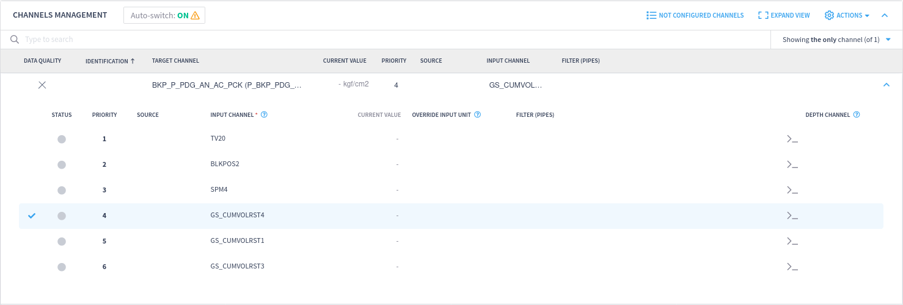
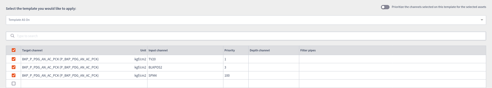
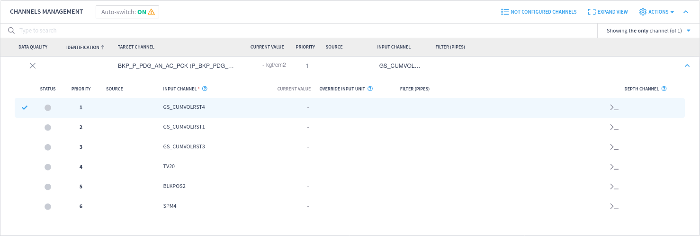
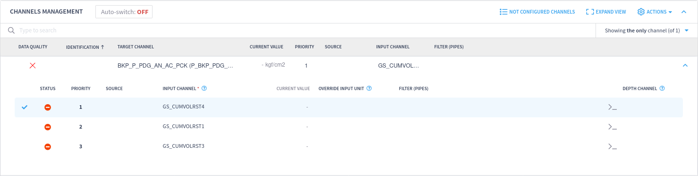
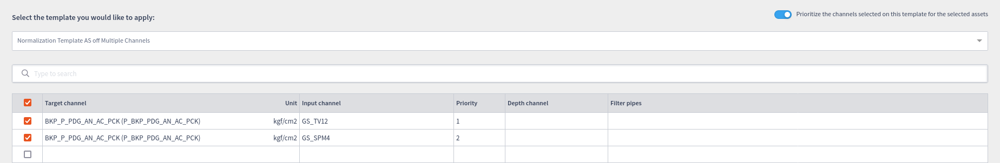
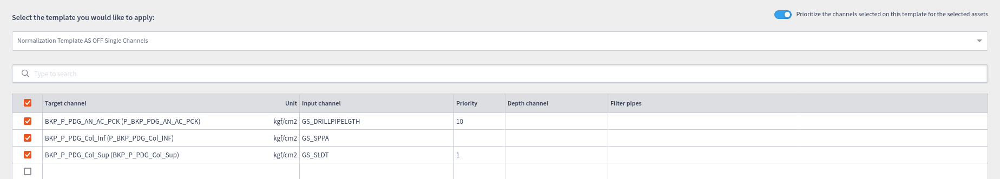
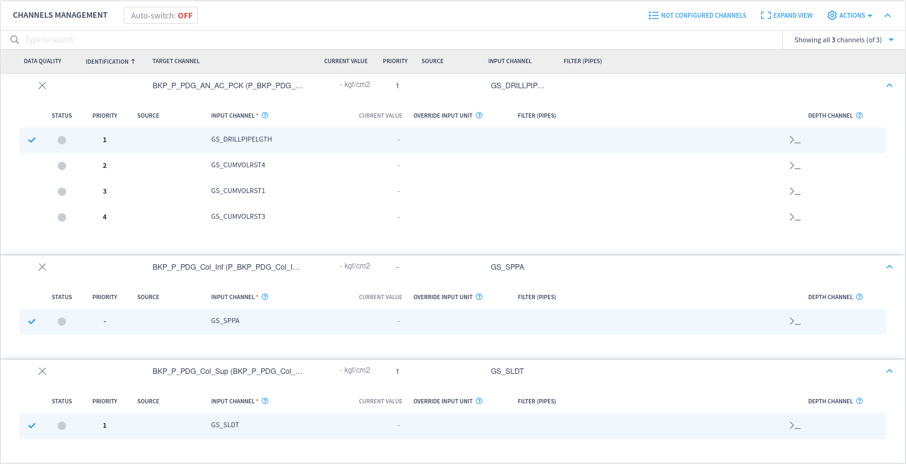

# Import template prioritization

When activating or deactivating the `Prioritize the channels selected on this template for the selected assets` toggle, there are some possible outcomes.

## Auto-switch on

When auto-switch is turned on, the imported channels will have different priorities upon importing based on the `Prioritize the channels selected on this template for the selected assets` toggle.

### `Prioritize the channels selected on this template for the selected assets` on

In the case the `Prioritize the channels selected on this template for the selected assets` toggle is turned on, the imported channels will always have higher priority than the existing channels.

This will be showcased in the example below, where the following channels already exist for a given asset:

<figure></figure>

And when importing the following normalization template:

<figure></figure>

This is the result obtained:

<figure></figure>

The result is that all imported channels will have higher priorities than the already existing ones. This happens because when the `Prioritize the channels selected on this template for the selected assets` toggle is turned on, every imported channel will have their priorities shifted to have the highest priority possible. So, if the priorities of the imported channels are `1`, `3` and `100`, they will be consolidated into `1`, `2` and `3` respectively, and the existing channels will shift theirs into `4`, `5` and `6` to accommodate the new channels. It does not matter how low the priority of the channels are in the template, if the toggle is on, they will always be put in front of the existing channels. 

### `Prioritize the channels selected on this template for the selected assets` off

In the case the `Prioritize the channels selected on this template for the selected assets` toggle is turned off, the imported channels will always have lower priority than the existing channels.

This will be showcased in the example below, where the following channels already exists for a given asset:

<figure><figcaption>
Saved normalization on an asset.
</figcaption></figure>

And when importing the following normalization template:

<figure></figure>

This is the result obtained:

<figure></figure>

The result is that all imported channel will have lower priorities than the already existing ones. This happens because when the `Prioritize the channels selected on this template for the selected assets` toggle is turned off, every imported channel will have their priorities shifted to have the lowest priority possible. So if the priorities of the imported channels are `1`, `3` and `100` they will turn into `4`, `5` and `6` respectively, and the existing channels will remain unchanged, keeping their priorities `1`, `2` and `3`. In this case, it does not matter how high the priorities of the imported channels are in the template, if the toggle is off, they will always be consolidated to a sequential range of priorities that goes right after the existing channels.

## Auto-switch off

When auto-switch is off, this toggle will change the active channel based on the priorities imported or if the channel imported is the only one for the target channel selected. The way priorities are shifted are exactly the same as when the auto-switch is turned on. The difference is that the active channel of a given target channel may be switched to be one of the imported input channels in some cases when auto-switch is off.

### Based on priority

In the case auto-switch is off, and there are multiple input channels being imported for a given target channel, and the `Prioritize the channels selected on this template for the selected assets` is on, the imported input channel with the highest priority will be automatically selected as the active channel of its respective target channel.

Having these channels as the configured ones:

<figure><figcaption>
Saved normalization on an asset.
</figcaption></figure>

And importing this template:

<figure><figcaption>
Saved normalization on an asset.
</figcaption></figure>

Will result in the channels being imported having the highest priority after merging with the existing channels in this asset. So, the channels with Input Channel `GS_TV12` and `GS_SPM4` will have priorities 1 and 2 respectively, while the already existing channels' priorities will be lowered to 3, 4 and 5.

<figure><figcaption>
Saved normalization on an asset.
</figcaption></figure>

Also, as the Auto-switch is turned off, the channel with Input Channel `GS_TV12` will be selected as active, as it has the highest priority among the imported channels. It is also possible to import multiple channels without priority for a given Target Channel, but in this case, if none of the imported channels have a declared priority, then none of them will be selected as active after importing.

### The only channel being imported

When the auto-switch is off, and the `Prioritize the channels selected on this template for the selected assets` is on, and there's only one channel being imported for a given target channel, those channels will be set as active, even if there's no priority set for them.

Having these channels as the configured ones:

<figure><figcaption>
Saved normalization on an asset.
</figcaption></figure>

And importing this template:

<figure><figcaption>
Saved normalization on an asset.
</figcaption></figure>

Will result on every channel imported being active after merging with the existing ones, if they exist. The priority in this case does not matter, so the channel without any priority, the channel with priority 1 and the channel with priority 10 will all be set as active when importing this template.

<figure><figcaption>
Saved normalization on an asset.
</figcaption></figure>

In this case, the channel without priority will remain without priority even when active, but the channels that have priority will be set to priority 1. This happens because when the toggle `Prioritize the channels selected on this template for the selected assets` is turned on, every priority of the imported channels will be set to be higher than those that already exist. In the example shown, the imported channel with target channel `GS_DRILLPIPELGTH` is being imported with priority 10, but as the prioritization toggle is on, it will have a higher priority than the channels that already exists. The result is that the imported channel will have the highest priority possible (which is 1) and the existing channels will all have their priorities offset.