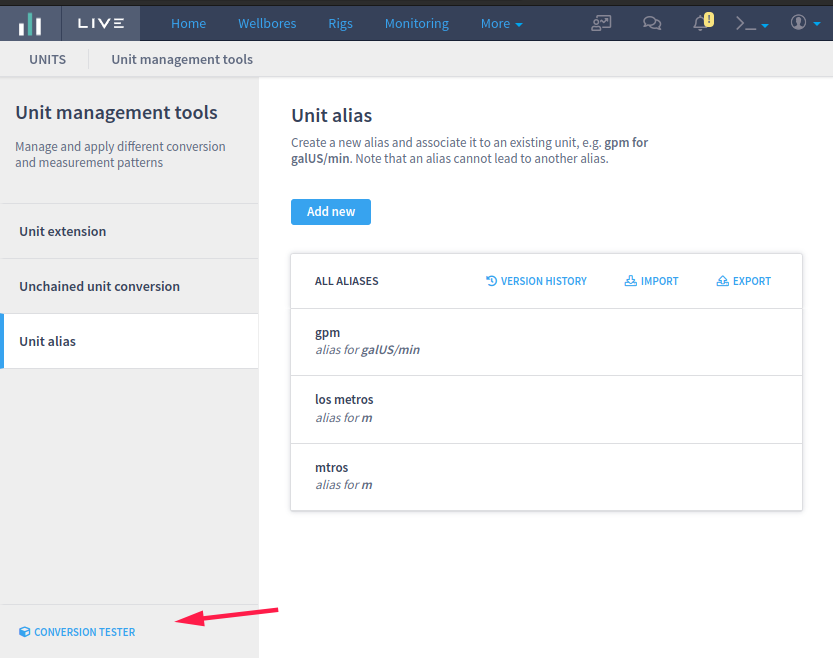

# Unit Management Tools

### **Introduction**

A feature to manage units of measure and unusual conversions. It has three main functionalities, [**Unit extension**](../../deprecated/liverig-v3/2.29.0.md#unit-extension), [**Unchained unit conversion**](../../deprecated/liverig-v3/2.29.0.md#unchained-unit-conversion), and [**Unit alias**](../../deprecated/liverig-v3/2.29.0.md#unit-alias). These features provide a way to create and edit new units, aliases, and unusual conversions via LIVE web interface. It can be found under menu Configurations > Unit Management Tools.\\

***

### **Unit extension**

It allows the creation of a new unit that does not exist in the system yet. A valid base unit must be chosen for the new unit and also a valid conversion factor must be defined to that.\\

***

***

The new unit will be displayed in the list after creation.

To delete a unit, just click on the garbage icon of the desired item and endorse your decision on the confirmation box.

### **Unit alias**

It associates a new word to a valid unit in the system. It is possible to create an alias for a common pre-existing unit like kg, N, m3\*\*,\*\* or even a new unit extension as created in the previous session.\\

The new aliases will be available in the list after creation.

To delete an alias, just click on the garbage icon of the desired item and endorse your decision on the confirmation box.

### **Unchained unit conversion**

This feature provides a way to create unusual conversions in the system. For example, in the native system, it is not possible to convert from kg to N. Using this functionality we can add the conversion for that. Unchained conversions can be created using only base units.\\

***

After creation, the new conversion can be seen on the list.

Although the opposite conversion is not displayed on the list, internally, all conversions created in the interface are bidirectional. It means that when you create a conversion kg -> N it is automatically possible to convert N -> kg.

.png>)

.png>)

To delete a conversion, just click on the garbage icon of the desired item and endorse your decision on the confirmation box.

### **Conversion tester**

At the bottom of the left panel, there is a **Conversion Tester** utility. It exercises the conversion. You can choose any builtin units, new units, aliases, or custom unchained units to convert to and from.

<figure><figcaption></figcaption></figure>

.png>)

.png>)

\*\*\*\*\
\*\*\*\*It is also possible to combine the features during a conversion:

.png>)

### **Pipes function**

The function, `curve_unit_convert(<number>, <string>, <string>) -> <number>`, receives a number to be converted as the first parameter, a string that is the source unit of the conversion as the second parameter, and, another string as the target unit of the conversion as the third parameter. It returns a number as the result of the conversion.

.png>)

### **Normalization and Dashboards**

Since 3.1.0, normalization/dashboards are being affected by this new feature!

### Side effects of deleting and renaming

At last, it's important to mention the known side effects of deleting or renaming a unit alias or an extension, or deleting a conversion.

#### At "Standard Channels" and "Calculated Channels"

The unit is no longer recognized by Live, and, then, will be displayed with a warning layout.

.png>)

#### **At "Data Management"**

If a conversion, unit alias, or extension that is being used to "Data Management" is deleted or renamed, the interface and the normalization threads the unit as Unknown

#### **At "Display Units"**

If a unit alias or a unit extension that is being used at Display Units, and is deleted or renamed, dashboards that use this "Display Units" will fail:

.png>)

And the Display Units will prevent the user from saving until the unit is changed to a known one:

.png>)
