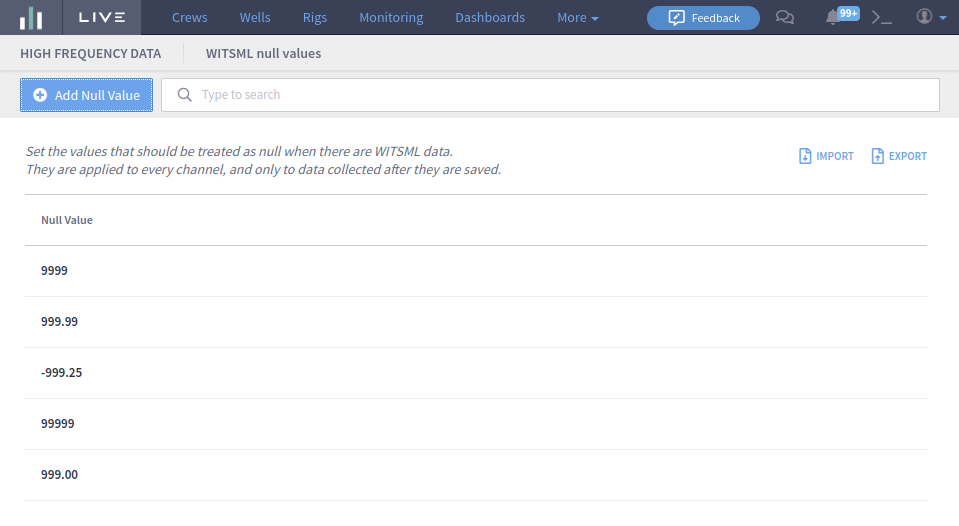

# WITSML Null Values

This feature allows the user to maintain a list of WITSML values that should be ignored globally by Live. They are applied to every channel, and only to data collected after they are saved.

The values are ignored at the Parser. So, if it is necessary to remove null values in the historical data, it would be necessary to recollect and renormalize.

## Screen

The WITSML Null Values screen allows to user to maintain the Null Values list. It's located under **Configurations** > **High Frequency Data** > **WITSML Null Values**.



## API


Please note that it is necessary to replace the term "environment" with the correct address before using the API.








```
["-999.21", "0."]
```









The array of null values (as strings). An empty array is accepted.



application/json



```
```



