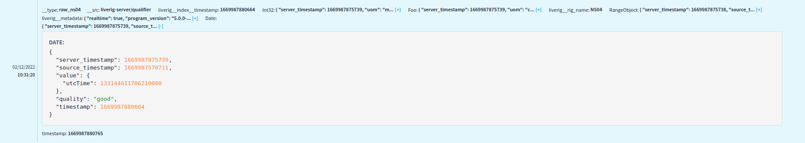
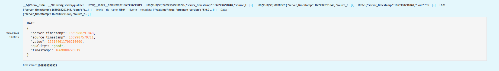
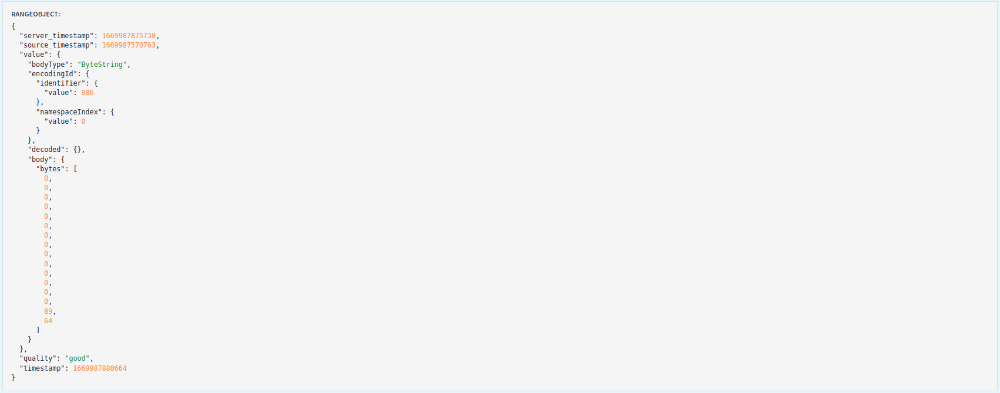

The Liverig collector also requires the Node Ids (Tags) values, among other information, to query properly. These values are mapped in the following JSON format, as below, inside the `store.json` file:

```json
{
  "database": {
    "url": "jdbc:postgresql://localhost:5432/?user=root&password=rootpassword"
  },
  "endpoint": "http://127.0.0.1:1234/witsml/store",
  "limit": 1234,
  "rigs": {
    "NS04": {
      "name": "NS04",
      "timestamp": "TIME",
      "tags": {
        "RandomInt32": "ns=2;s=Dynamic/RandomInt32",
        "RandomInt64": "ns=2;s=Dynamic/RandomInt64"
      },
      "units": {
        "RandomInt32": "m",
        "RandomInt64": "m/s"
      },
      "types": {
        "RandomInt32": "long",
        "RandomInt64": "long"
      }
    }
  }
}
```

Each object under rigs is related to an **OPC-DA** or **OPC-UA** Source, linking the `store.json` and `sources.xml` files through their Rig Name. Some generic fields configure global collector settings: database, endpoint, and limit. These configurations are required if the **OPC** Source is going through the **OPC** to **WITSML** conversion.

The alias is used as a key reference for tags, units and types values.&#x20;

| Name      | Description                        | Required                             | Default value |
| --------- | ---------------------------------- | ------------------------------------ | ------------- |
| name      | An identifier for this rig         | **yes**                              |               |
| timestamp | A timestamp field identifier       | no                                   | TIMESTAMP     |
| tags      | Uses the Tag (nodeId) as a value.  | **yes**                              |               |
| units     | Uses the UOM as a value            | no                                   |               |
| types     | Uses the type as a value           | no (if OPC to WITSML converter, yes) | double        |

Obs: For **OPC-UA** sources, the tag field should be written as the following pattern: `ns=<namespaceindex>;<type>=<value>`

### For Liverig Collector versions 5.0.0 or above

Since Liverig Collector version 5.0.0, the collector can be configured to extract field from object values in **OPC-UA** sources. 

**Example:**



In this event, the OPC-UA source returned a value structured as an object with the following format:

```json
{
  "utcTime": 133144611706210000
}
```

To extract the field `utcTime` as the value itself we need to configure the tag using the `?field=` parameter. Example:
`{tag}?field={path}`.

So, in this example the previous tag `"ns=2;s=HelloWorld/ScalarTypes/UtcTime"` would be changed to `"ns=2;s=HelloWorld/ScalarTypes/UtcTime?field=/utcTime"`
Resulting in the following value:



**Example2:**



In this event, the OPC-UA source returned a value structured as an object with the following format:

```json
{
  "bodyType": "ByteString",
  "encodingId": {
    "identifier": {
      "value": 886
    },
    "namespaceIndex": {
      "value": 0
    }
  },
  "decoded": {},
  "body": {
    "bytes": [0,0,0,0,0,0,0,0,0,0,0,0,0,0,89,64]
  }
}
```
To extract the field `endodingId/indentifier/value` as the value itself we need to configure the tag using the `?field=` parameter. Example:
`{tag}?field={path}`.

So, in this example the previous tag `"ns=2;s=HelloWorld/DataAccess/AnalogValue/0:EURange"` would be changed to `"ns=2;s=HelloWorld/DataAccess/AnalogValue/0:EURange?field=/encodingId/identifier/value"`.
If you want to extract other fields from the same object, you can declare it as a new tag, like `"ns=2;s=HelloWorld/DataAccess/AnalogValue/0:EURange?field=/encodingId/namespaceIndex/value"`
to extract the `encodingId/namespaceIndex/value` as a value.

Resulting in the following value:


**OBS**: Since the `tags` field from the `store.json` file is a `Map`, you need to add a new alias for each field you want to fetch. Example:
`"RangeObject/Identifier": "ns=2;s=HelloWorld/DataAccess/AnalogValue/0:EURange?field=/encodingId/identifier/value"` and
`"RangeObject/namespaceIndex": "ns=2;s=HelloWorld/DataAccess/AnalogValue/0:EURange?field=/encodingId/namespaceIndex/value"`


 
Instead of manually configuring this file, is also possible to use the remote control page [OPC Requests](./../remote-control/sources/opc-requests.md) to easily change settings.

