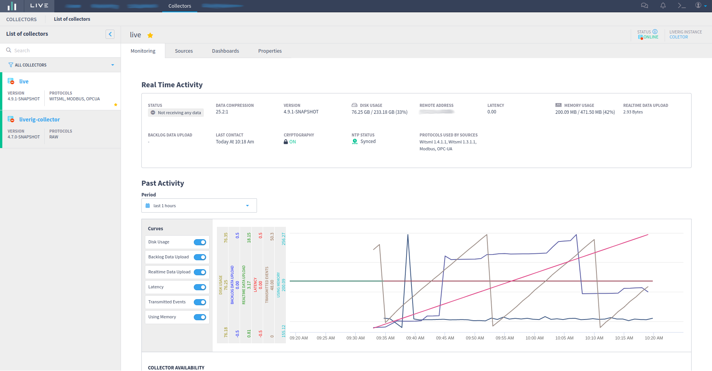
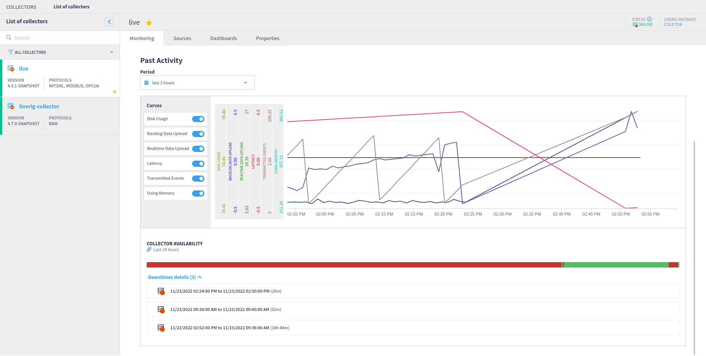
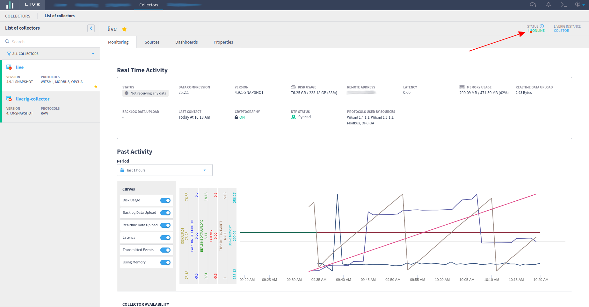
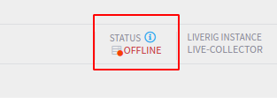
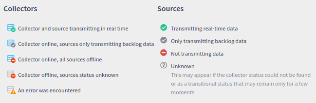
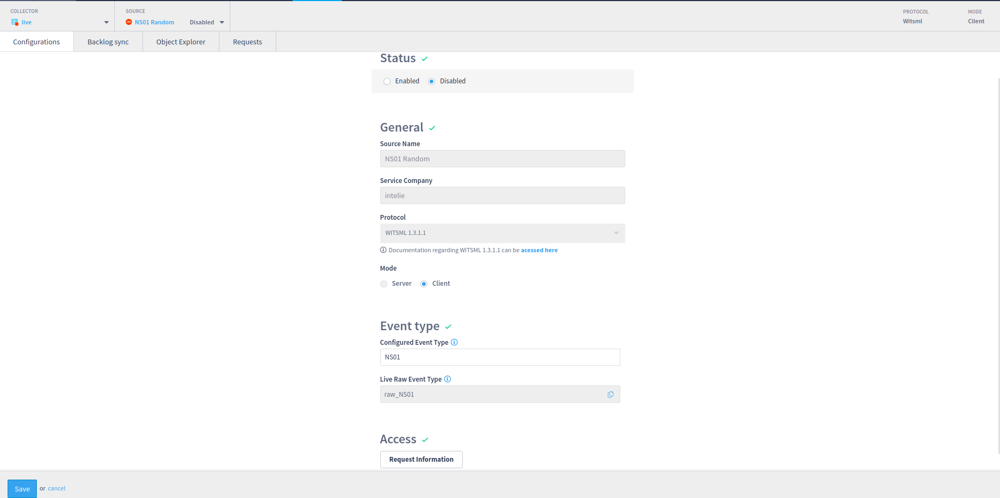
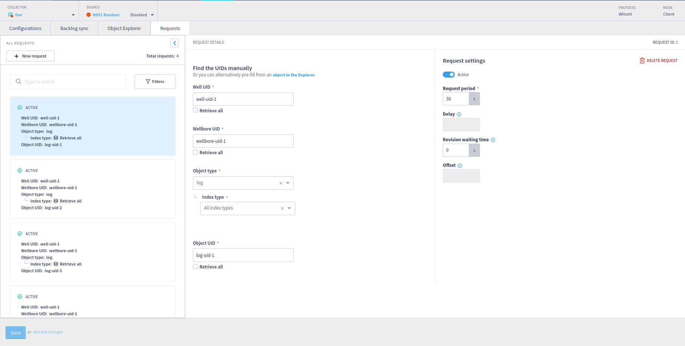
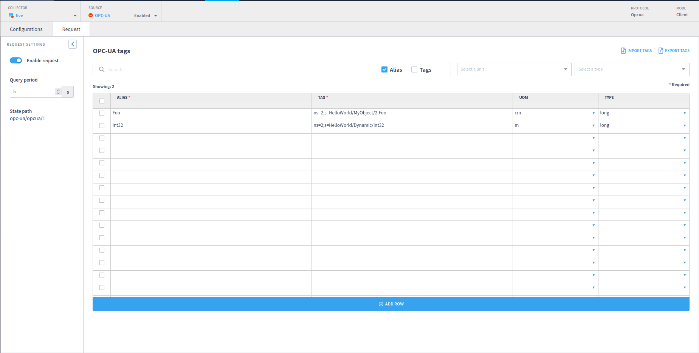

# Monitoring

On Intelie Live `Collectors` tab, it is possible to get an overview of all the active collectors and drill down to troubleshoot any issue regarding data collection and transmission.

The interface provides information regarding data availability and quality, transmission and compression rates, SSL/TLS status, and other information about the health of the collectors.

**Collector Status**

The Collector Status will be shown in the upper right corner of the Collector List screen.

You can click on the **information icon** to find each label description.

 


If you need more info about the status of the collector, you can query the `liverig_server_event` event type.




When a LiveRig Collector fails to authenticate to the Plugin LiveRig, it will generate an **Unknown** collector. To find more information about this Unknown collector, you can query the `liverig_server_event` to detect the error message.


**Sources Status**

The sources are clickable and Intelie Live provides more details of the source in a modal.

For every protocol available, Intelie Live will display basic source information and configuration. For WITSML (only client mode) and OPC sources, a request tab is also available, showing requests configured and information available in the server can be requested.

### The `internal` event

Once per minute, every collector generates an event with many statistics associated to its health and the health of the sources of data. The events provided by different collectors are used by Intelie Live as a heartbeat, and provide a full view of the collectors' infrastructure.

.png>)

The fields contained on this type of event are detailed below.

| Field                                                                                                                                                         | Type    | Since  |
| ------------------------------------------------------------------------------------------------------------------------------------------------------------- | ------- | ------ |
| `freeMemory`                                                                                                                                                  | long    |        |
| The amount of free memory in the Java Virtual Machine.                                                                                                        |         |        |
| `totalMemory`                                                                                                                                                 | long    |        |
| The total amount of memory in the Java virtual machine.                                                                                                       |         |        |
| `maxMemory`                                                                                                                                                   | long    |        |
| The maximum amount of memory that the Java virtual machine will attempt to use.                                                                               |         |        |
| `storageUsedEvents`                                                                                                                                           | long    |        |
| Number of events stored for possible retransmission.                                                                                                          |         |        |
| `storageUsedBytes`                                                                                                                                            | long    |        |
| Size of events stored for possible retransmission.                                                                                                            |         |        |
| `receivedBytesControl`                                                                                                                                        | long    |        |
| Number of bytes received by the collector on the control channel.                                                                                             |         |        |
| `receivedBytesRealtime`                                                                                                                                       | long    |        |
| Number of bytes received by the collector on the realtime channel, after compression.                                                                         |         |        |
| `receivedBytesResent`                                                                                                                                         | long    |        |
| Number of bytes received by the collector on the retransmission channel, after compression.                                                                   |         |        |
| `receivedBytesRemoteControl`                                                                                                                                  | long    |        |
| Number of bytes received by the collector on the remote control channel, after compression.                                                                   |         |        |
| `sentBytesControl`                                                                                                                                            | long    |        |
| Number of bytes sent by the collector on the control channel.                                                                                                 |         |        |
| `sentBytesRealtime`                                                                                                                                           | long    |        |
| Number of bytes sent by the collector on the realtime channel, after compression.                                                                             |         |        |
| `sentBytesResent`                                                                                                                                             | long    |        |
| Number of bytes sent by the collector on the retransmission channel, after compression.                                                                       |         |        |
| `sentBytesRemoteControl`                                                                                                                                      | long    |        |
| Number of bytes sent by the collector on the remote control channel, after compression.                                                                       |         |        |
| `receivedBytesCompressed`                                                                                                                                     | long    |        |
| Number of bytes received by the collector before decompression.                                                                                               |         |        |
| `receivedBytesUncompressed`                                                                                                                                   | long    |        |
| Number of bytes received by the collector after decompression.                                                                                                |         |        |
| `sentBytesCompressed`                                                                                                                                         | long    |        |
| Number of bytes sent by the collector after compression.                                                                                                      |         |        |
| `sentBytesUncompressed`                                                                                                                                       | long    |        |
| Number of bytes sent by the collector before compression.                                                                                                     |         |        |
| `protocolErrors`                                                                                                                                              | long    |        |
| Number of protocol errors such as invalid stream, invalid command or data framing errors.                                                                     |         |        |
| `secure`                                                                                                                                                      | boolean | 2.18.0 |
| Whether the connection is using the built-in cryptography.                                                                                                    |         |        |
| `drops`                                                                                                                                                       | map     |        |
| Number of answers rejected by the data sources.                                                                                                               |         |        |
| `config`                                                                                                                                                      | map     |        |
| The configuration that is provided by the `sources.xml` file.                                                                                                 |         |        |
| `runningConfig`                                                                                                                                               | map     |        |
| The configuration that is actually being executed. This can be different of the `config` field due to either inactive datasources or wildcard configurations. |         |        |
| `system.ntp`                                                                                                                                                  | map     |        |
| Information about the NTP state of the host machine, if available.                                                                                            |         |        |
| `system.disk`                                                                                                                                                 | map     | 2.14.2 |
| Information about the local disks state, if available.                                                                                                        |         |        |
| `internalEventsPeriod`                                                                                                                                        | long    | 4.7.0  |
| Period (in milliseconds) to compute and transmit the internal events reporting actual source configuration and basic server statistics to central sites.      |         |        |
| `configurationStatus`                                                                                                                                         |         |        |
| Contains the hashcode of the liverig properties file, the modbus, the OPC and the gerenal sources configuration files.                                        | map     | 5.0.0  |


All the counters, such as bytes and received, errors, and drops, reset every time the collector is restarted.



The bytes transferred on the control channel are not compressed, since this is the channel that negotiates the compression.

