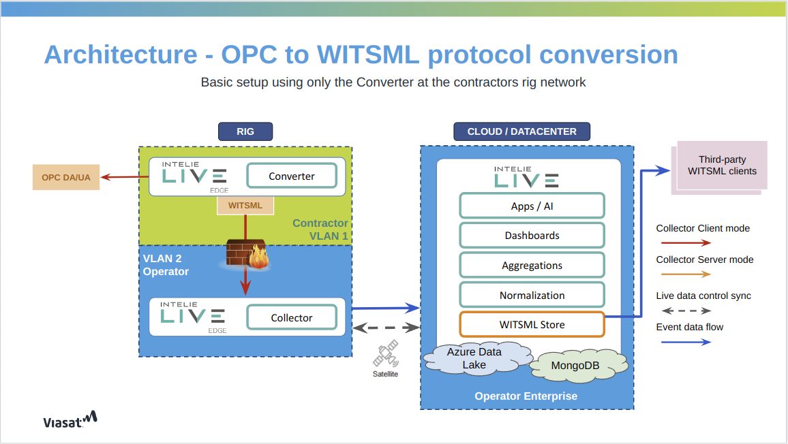

# Protocol conversion

The collector is also designed to act as a protocol converter, that is, it can read the data in OPC-DA or OPC-UA format
and deliver it on WITSML format. That action could be performed in any deployed instance.



The OPC to WITSML conversion works by running a basic WITSML server backed by a PostgreSQL or TimescaleDB database, where the Live Rig
Collector will query the OPC server and expose its data as an WITSML server.

To configure this feature, you need to configure an OPC-DA or OPC-UA Source on the LiveRig Collector. For more
information,
see the [OPC-DA](./protocols/opc-da.md) or [OPC-UA](./protocols/opc-ua.md) pages, along with
the [sources.xml](./configuration/sources.xml.md)
and [store.json](./configuration/store.json.md) pages for file configurations.

The [store.json](./configuration/store.json.md) file contains 4 fields exclusively for the OPC to WITSML conversion
feature.
These are: `database`, `endpoint`, `limit` and `purge`.

### Database

The `database` field is required for connecting to the local database instance used in the conversion.
To specify which database will be used (PostgreSQL, TimescaleDB), just configure a flag inside the parameter field of the database section.

*Example:*

```json
"database": {
    "url": "jdbc:postgresql://localhost:5432/?user=root&password=rootpassword",
    "parameters": {
        "timescale": false
    }
}
```

The default database is PostgreSQL, which means that if configuration parameters are not provided, or if it's
provided with the timescale flag set to false, PostgreSQL will be used.

By enabling TimescaleDB, we can take advantage of its compression features, capable of decreasing the total
amount of used disk space.
To install a TimescaleDB instance, you need to configure the extension accordingly.

For more details, see [Installing TimescaleDB](https://docs.timescale.com/self-hosted/latest/install/)
on the official docs.

#### TimescaleDB Configuration

A valid TimescaleDB configuration looks like the following:

```json
"database": {
    "url": "jdbc:postgresql://localhost:5432/?user=root&password=rootpassword",
    "parameters": {
        "timescale": true,
        "timescale.chunk_interval": 604800000,
        "timescale.compress_after": 3600000
    }
}
```

- ***Chunk Interval***: Hypertables in TimescaleDB are automatically partitioned into smaller pieces, called chunks.
Each chunk contains a specific amount of data, defined by chunk interval configuration.
Behind the scenes, each chunk is the smallest portion of data that can be compressed and decompressed.
`timescale.chunk_interval` setting is expressed in milliseconds, and defaults to 7 days (604800000 ms).


- ***Compress After***: Represents the amount of time after which the hypertable chunks will be automatically
compressed in the background. A recurrent policy is set to compress every chunk containing data older
than this configuration. `timescale.compress_after` setting is also expressed in milliseconds,
and defaults to 1 hour (3600000 ms).


### Endpoint

The `endpoint` field is necessary for exposing an WITSML Server endpoint with the collected data. *Example:*

```json
"endpoint": "http://127.0.0.1:1234/witsml/store"
```

### Limit

The `limit` field is not a necessary field. Its purpose is to limit the number of values to be returned on a request to
the WITSML store.
The default value is `1000`.

### Purge

The `purge` field is not a necessary field. Its purpose is to set a period to purge old values from the WITSML store (to
avoid the collector's disk filling up).
This is calculated using the following formula: `CURRENT_TIMESTAMP - PURGE_INTERVAL`. This interval is used in seconds.
*Example:*
If the `purge` field value is `1000`, that means that values older than 1000 seconds from the current time will be
deleted.
The default state of this feature is `off`.

After configuring the OPC to WITSML conversion an WITSML server endpoint will be created. With this new endpoint you can
configure a new [WITSML](./protocols/witsml.md) Source at a LiveRig Collector or use a WITSML Store for fetching data.


When used in pure protocol conversion mode, the collector does not need the presence of a centralized INTELIE Live
environment.

