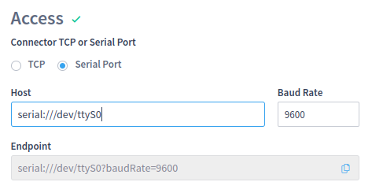

# CSV

LiveRig collector supports the pushing of CSV payloads in order to convert them into Live events.

That is a very simple alternative to input data from third-party software through a LiveRig collector instance, typically co-located at operational sites.

### Configuration by remote control

Once the [Remote Control](../remote-control/) feature is enabled, the user can configure a new CSV source remotely as follows:

<figure><figcaption><p>Overview of CSV source configuration options</p></figcaption></figure>

#### Null values

As a textual representation, CSV typically carries some standard number that needs to be interpreted as **null values**. The CSV source enables you to specify your typical values and drop them from the actual event representation for the channels.

#### Date time pattern

The date time pattern can be customized to detect seconds, milliseconds, or textual samples of information like months, AM/PM marks, or either some fixed strings in the rows which represent the timestamp of each data measurement. See the [full list of symbols supported](https://docs.oracle.com/javase/8/docs/api/java/time/format/DateTimeFormatter.html) (as in Java).

<figure><figcaption><p>Date time custom format configuration rules</p></figcaption></figure>

Each column in the CSV file will be interpreted as a channel value and the first column will be the date time index for each row in the dataset.

#### Access endpoint

The CSV source can execute in client or server mode. Third parties applications may push data into the LiveRig CSV source endpoint.

Starting at LiveRig 4.7.0, the access configuration supports both TCP and Serial ports:

<div>

<figure><figcaption><p>TCP port configuration for CSV source endpoint</p></figcaption></figure>

 

<figure><figcaption><p>Serial port configuration for CSV source endpoint</p></figcaption></figure>

</div>

The TCP connector puts the source in **server mode** and waits for data to be pushed into it. On the other hand, the Serial port connector configures the source as **client mode** and watches the Unix device file to consume the data passing through.

Starting at Liverig 4.11.0, CSV client mode support both TCP and Serial connection protocols, and Server mode supports only TCP connection protocol.
If server mode is enabled, the Serial Port radio button will be disabled:


<figure><figcaption><p>Serial port disabled for CSV Server Mode</p></figcaption></figure>

In case, any older LiveRig Collector is used in the edge installation, the selection for Serial ports will be unavailable since only TCP endpoints are allowed up to 4.6 series.

<figure><figcaption><p>Warning the lack of support for serial port connections at local sites</p></figcaption></figure>

### Configuration by source file

Locally in the LiveRig Collector machine, the [`sources.xml` can be configured](../configuration/sources.xml.md) as demonstrated below. This configuration opens the TCP port 9873 on all local interfaces to listen for CSV files.

```markup
<source>
	<name>CSV endpoint</name>
	<mode>server</mode>
	<rig_name>my_rig</rig_name>
	<service_company>my_company</service_company>
	<protocol_name>csv</protocol_name>
	<endpoint>tcp://0.0.0.0:9873/</endpoint>
</source>
```

This other example reads the first COM port in a Unix system available at /dev/ttyS0 to watch for events in CSV format.

```markup
<source>
	<name>CSV endpoint</name>
	<mode>client</mode>
	<rig_name>my_rig</rig_name>
	<service_company>my_company</service_company>
	<protocol_name>csv</protocol_name>
	<endpoint>serial:///dev/ttyS0?baudRate=9600</endpoint>
</source>
```
