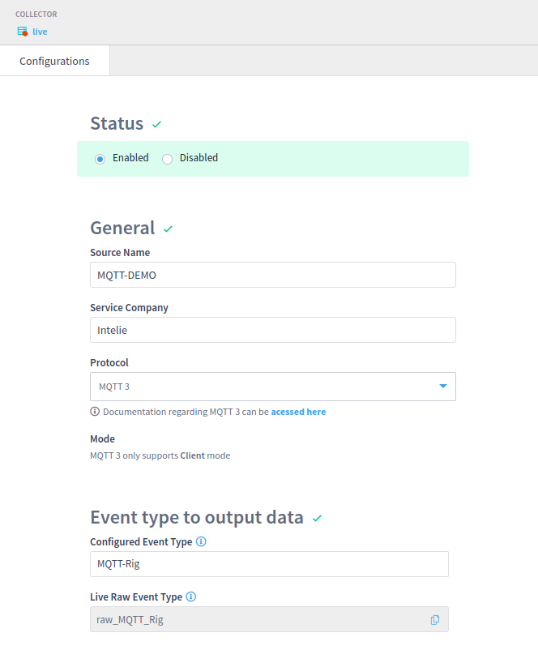
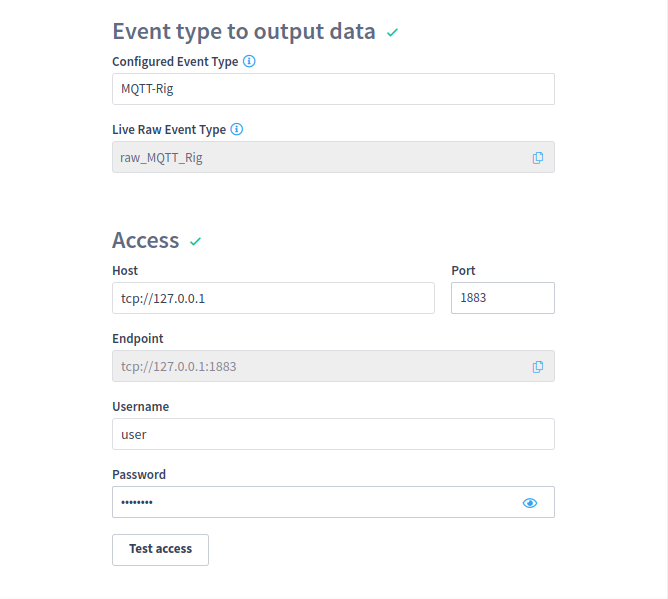

# MQTT


This capability is provided by **LiveRig Collector 3.25.0** or higher


The **MQTT** protocol is a message-oriented architecture that does not work polling information, it instead works by passively receiving messages from subscribed Topics sent by the MQTT Broker.
The **MQTT** Broker requires that the client must be subscribed to Topics that it wants to receive data from.

Example:

```xml
<source>
    <name>MQTT-DEMO</name>
    <enabled>true</enabled>
    <mode>client</mode>
    <rig_name>MQTT-Rig</rig_name>
    <service_company>intelie</service_company>
    <protocol_name>mqtt</protocol_name>
    <protocol_version>0.0.0</protocol_version>
    <endpoint>tcp://127.0.0.1:1883</endpoint>
    <username>user</username>
    <password>password</password>
    <requests>
        <request>
            <object>test/+/pump</object>
            <enabled>true</enabled>
        </request>
        <request>
            <object>test/temperature</object>
            <enabled>true</enabled>
        </request>
    </requests>
</source>
```

The same example could be configured through the source page, at the collector's tab:
<figure></figure>
<figure></figure>

In the example above we can see that an MQTT Source must have at least a single Request and the following information must be provided:

| Name    | Description                | Required | Default value |
|---------|----------------------------|----------|---------------|
| object  | Topic to subscribe         | **yes**  |               |
| enabled | Request collection enabled | no       | False         |

The LiveRig Collector also ***requires*** additional information for each Topic to subscribe properly. 
These values should be configured at the [MQTT Topics page](../remote-control/sources/mqtt-topics.md) or directly at the [mqtt.json](./../configuration/mqtt.json.md) file.