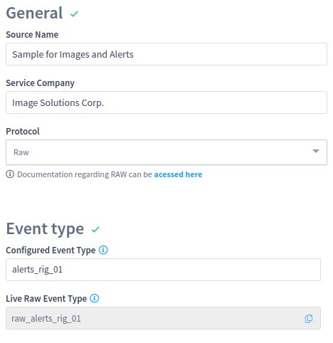

# RAW

The raw protocol is capable of receiving data in JSON format via TCP or Serial port.

If the data format respects the same raw schema that the collector generates for other protocols, the data can be normalized in Intelie Live.

### Configuration by remote control

Once the [Remote Control](../remote-control/) is enabled, the centralized Live can coordinate the source creation directly in an UI as follows:

<figure><figcaption><p>Source configuration for RAW protocol</p></figcaption></figure>

#### Access endpoint

Starting at LiveRig 4.7.0, the access configuration supports both TCP and Serial ports:

<div>

<figure><figcaption><p>TCP port configuration for RAW source endpoint</p></figcaption></figure>

 

<figure><figcaption><p>Serial port configuration for RAW source endpoint</p></figcaption></figure>

</div>

The TCP connector puts the source in **server mode** and waits for data to be pushed into it. On the other hand, the Serial port connector configures the source as **client mode** and watches the Unix device file to consume the data passing through.

In case, any older LiveRig Collector is used in the edge installation, the selection for Serial ports will be unavailable since only TCP endpoints are allowed up to 4.6 series.

<figure><figcaption><p>Warning the lack of support for serial port connections at local sites</p></figcaption></figure>

### Configuration by source file

Locally in the LiveRig Collector machine, the [`sources.xml` can be configured](../configuration/sources.xml.md) as demonstrated below. This configuration opens the TCP port 9876 on all local interfaces to listen for events in JSON format.

```markup
<source>
	<name>Raw endpoint</name>
	<mode>server</mode>
	<rig_name>my_rig</rig_name>
	<service_company>my_company</service_company>
	<protocol_name>raw</protocol_name>
	<endpoint>tcp://0.0.0.0:9876/</endpoint>
</source>
```

This other example reads the first COM port in a Unix system available at /dev/ttyS0 to watch for events in JSON format.

```markup
<source>
	<name>Raw endpoint</name>
	<mode>client</mode>
	<rig_name>my_rig</rig_name>
	<service_company>my_company</service_company>
	<protocol_name>raw</protocol_name>
	<endpoint>serial:///dev/ttyS0?baudRate=9600</endpoint>
</source>
```

A sample of the JSON payload supported as Intelie Live events. This sample is compliant with the data schema required by the [normalization](../../data-flow/data-normalization/) engine.

```javascript
{
   "liverig__index__timestamp": 12345,
   "channel1": {
       "value": 1.0,
       "uom": "m"
   },
   "channel2": {
       "value": 2.0,
       "uom": "m"
   },
   "channel3": {
       "error": "something went wrong"
   }
}
```
