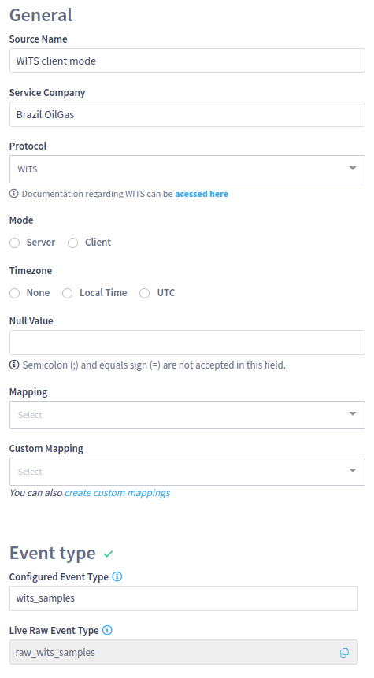
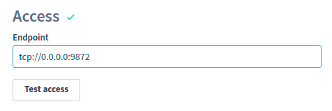

# WITS

Data in WITS format can be transferred to the collector over Serial ports or TCP connections.

The WITS metadata is applied by INTELIE Live during the normalization process when generating the raw JSON events.


Data is always transmitted from the collector to INTELIE Live exactly as it was received from the sources, for any protocol.


INTELIE Live follows the [WITS specification](http://www.petrospec-technologies.com/resource/wits\_doc.htm) to add the names, the set of units (imperial/UK, imperial/US or metric) and to relate a depth value to each sample. Spare channels can be associated with names and units in the web interface.

As it occurs with data transmitted in any other protocol, those names and units are present on the raw events but are converted to the environment standards in the normalized events.

INTELIE Live supports WITS Level 0.

**Disclaimer:** WITS is a petroleum industry standard dated 90's (see [WITS ≠ WITSML](https://www.energistics.org/portfolio/witsml-data-standards/) on Energistics), so could be difficult to find out the spec, we also recommend a [page hosted by http://home.sprynet.com/\~carob (archived by web.archive.org)](https://web.archive.org/web/20170110225236/http://home.sprynet.com/\~carob) and the [paper published in SPE Drilling Engineering Volume 4, Issue 04, December 1989](https://doi.org/10.2118/16141-PA).

### Configuration by remote control

Once the [Remote Control](../remote-control/) is enabled, the centralized Live can coordinate the source creation directly in an UI as follows:

<figure><figcaption><p>WITS source configuration options</p></figcaption></figure>

#### Null values

As a textual representation, WITS typically carries some standard number that needs to be interpreted as **null values**. The WITS source enables you to specify your typical values and drop them from the actual event representation for the channels.

#### Mapping

Enables the user to choose between three standard record mappings.

<figure><figcaption><p>Standard WITS record mappings supported</p></figcaption></figure>

#### WITS custom mapping

Selects a custom mapping between WITS records and channel mnemonics supported in Live. See [WITS Custom Mapping](../../administration/high-frequency-data/wits-custom-mapping.md) for more details.

#### Server mode configuration

In server mode, only the TCP configuration is supported, then the access endpoint will display a very simple input to configure the IP address and the port.

<figure><figcaption><p>TCP Port configuration for WITS in server mode</p></figcaption></figure>

#### Client mode configuration

For WITS client mode configuration, the access endpoint configuration will support both TCP and Serial ports (starting at LiveRig 4.7.0) as described:

<div>

<figure><figcaption><p>TCP port configuration for WITS client endpoint</p></figcaption></figure>

 

<figure><figcaption><p>Serial port configuration for WITS client endpoint</p></figcaption></figure>

</div>

In case, any older LiveRig Collector is used in the edge installation, the selection for Serial ports will be unavailable since only TCP endpoints are allowed up to 4.6 series.

<figure><figcaption><p>Warning the lack of support for serial port connections at local sites</p></figcaption></figure>

### Configuration by source file

Locally in the LiveRig Collector machine, the [`sources.xml` can be configured](../configuration/sources.xml.md) as demonstrated below. This configuration opens the TCP port 9872 on all local interfaces to listen for WITS data.

```markup
<source>
        <name>WITS sample</name>
        <mode>server</mode>
        <rig_name>my_rig</rig_name>
        <service_company>My Company</service_company>
        <protocol_name>wits;0;metric;null=9999;tz=utc</protocol_name>
        <endpoint>tcp://0.0.0.0:9872</endpoint>
</source>
```

This other example reads the first COM port in a Unix system available at /dev/ttyS0 to watch for data in WITS format.

```markup
<source>
        <name>WITS Sample</name>
        <mode>client</mode>
        <rig_name>my_rig</rig_name>
        <service_company>My Company</service_company>
        <protocol_name>wits;0;metric;null=9999;tz=utc</protocol_name>
        <endpoint>serial:///dev/ttyS0?baudRate=9600</endpoint>
</source>
```
