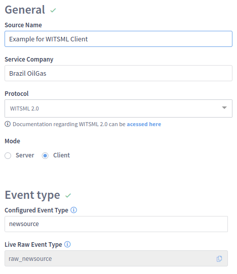
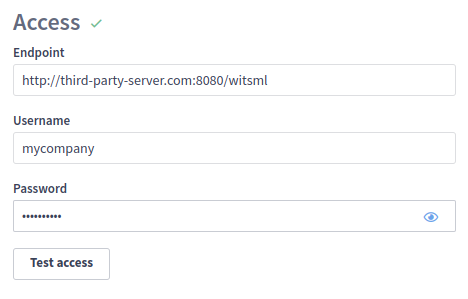
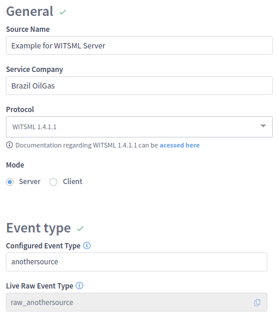
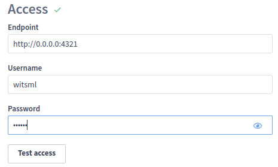

# WITSML

[WITSML](https://energistics.org/witsml-data-standards) (Wellsite Information Transfer Standard Markup Language) is a standard protocol for transmitting technical data in petroleum insdustry organizations

To collect WITSML data, the collector can connect to several different data sources simultaneously and act either as a **client**, requesting periodically new data, or as a **server**, receiving data from any third-party client.


Currently supported WITSML versions are 1.3.1, 1.4.1 and 2.0.


In both modes (server or client), the WITSML capabilities on the LiveRig Collector are limited to the objects listed below. The data ingested by those objects typically will be transmitted to Intelie Live and converted as events for both real-time and historical analytics.

* Version 1.3 and 1.4
  * log (depth and time-based)
  * mudLog
  * message
  * trajectory
  * wbGeometry
  * tubular
* Version 2.0
  * log (depth and time-based)

This support enables the data import into the edge environments (typically in physical rigs with small hardware requirements).&#x20;

A more complete feature for WITSML capabilities is also provided through the [WITSML Store plugin](../../integrations/witsml-store.md) in a full Intelie Live installation (central or at the edge environments).

### Configuration

Once the [Remote Control](../remote-control/) feature is enabled, the user can configure a new WITSML source remotely as follows.

#### Client mode

<figure><figcaption>
WITSML source in client mode
</figcaption></figure>

<figure><figcaption>
Access point to the third-party witsml server to pull data from periodically
</figcaption></figure>

#### Server mode

<figure><figcaption>
WITSML source in server mode
</figcaption></figure>

The endpoint configuration for server mode will depend on a HTTP port available on the collector machine to listen for connections from third-party clients. Any external client may push data into this endpoint through WITSML using the credentials filled at this form.

<figure><figcaption>
Endpoint to listen for WITSML connections, then third parties may push data into.
</figcaption></figure>

## Collect and manipulating WITSML data in Live 

* [Backlog Syncronization](witsml/backlog-sync/README.md)
    * [Mnemonic Standardization](witsml/object-explorer/standardization.md)
* [Object Explorer](witsml/object-explorer/README.md)
* [Requests](witsml/requests/README.md)
* [WITSML Browser](witsml/witsml-browser/README.md)