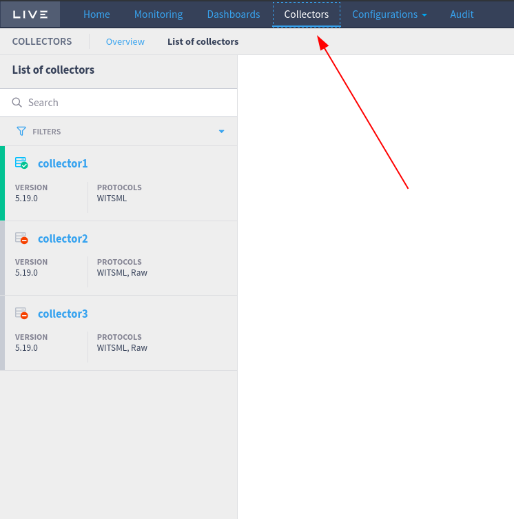
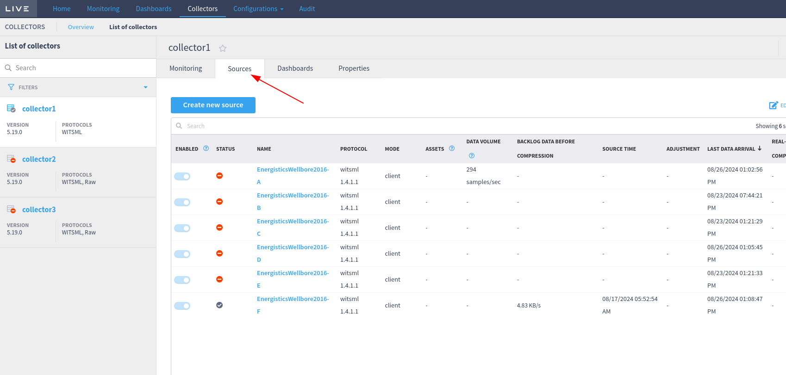
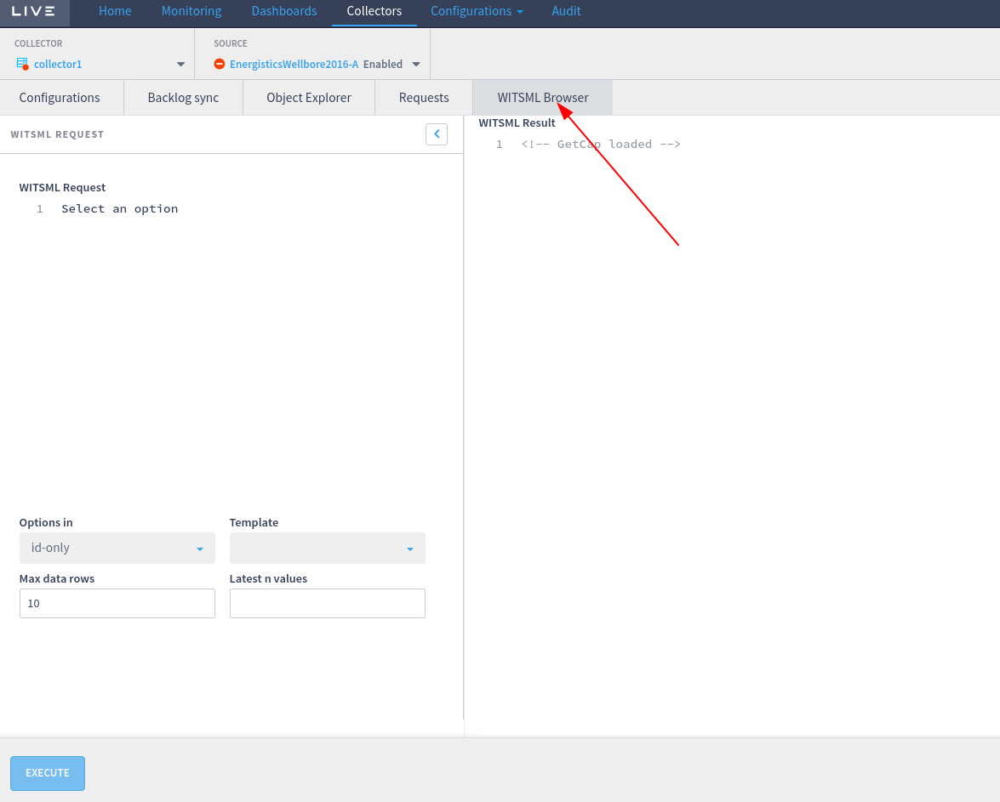
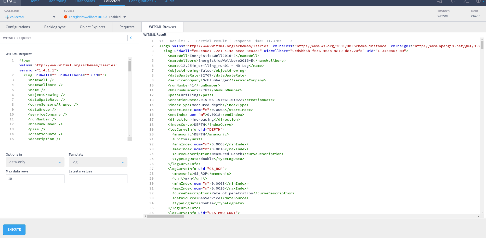

# WITSML Browser

_WITSML browser_ is a feature introduced since Liverig version  >= 5.18.x that allows user to read WITSML objects in selected source.

Liverig executes _GetFromStore_ function in configured _WITSML Store_ server to access objects in WITSML Server using _remote control_

To open _WITSML browser_ go to _collectors_

And select one collector e.g. _collector1_

Go to _Sources_ tab and select one _WITSML_ source. E.g. _EnergisticsWellbore2016-A_

Now select _WITSML browser_ tab

Select one template or edit _XML request_ and select available options and click _EXECUTE_ button

