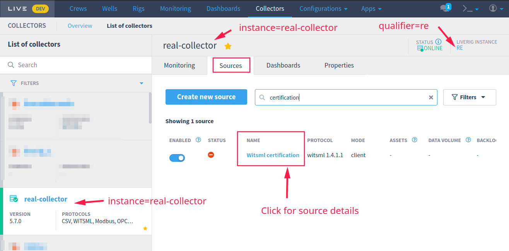
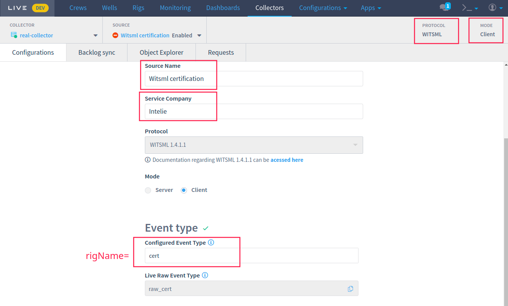

# /testSourceEndpoint

This feature allows you to validate the endpoint connection against the effective server (for some protocols like WITSML, OPC, ModBus) behind the LiveRig Collector using the remote control API.

## Required information






Please note that it is necessary to replace the term "environment" with the correct address before using the API.




Test a source endpoint. Currently supports all server mode protocols, and WITSML, Modus and WITS in client mode.



Collector qualifier



Collector instance



application/json



Basic information about how to connect to the source endpoint. See examples below. 




```
{
    "success": {
        "result": "true"
    }
}
```




### Body examples

```
{

    "name": "same used in collector source name",
    "rigName": "same used in collector source rig name",
    "serviceCompany": "same used in collector source service company",
    "username": "myuser",
    "password": "un%prot3ct3d",
    "endpoint": "http://mywitsml.server.com",
    "mode": "client", // or "server",
    "protocolName": "witsml",
    "protocolVersion": "1.4.1.1",
    "tlsAuth": false // or true
}
```


### Response examples



```
{
    "success": {
        "result": "true"
    }
}
```



```
{
    "success": {
        "result": "false",
        "exception": "javax.xml.ws.WebServiceException",
        "message": "Unsupported endpoint address: asd1"
    }
}
```



```
{
    failure: "error message string"
}
```



