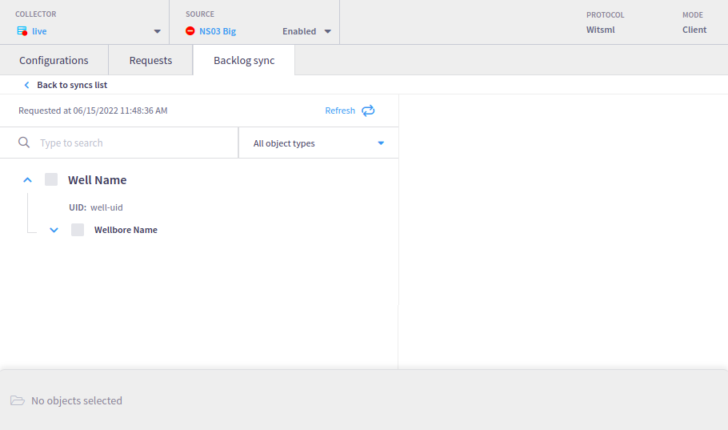
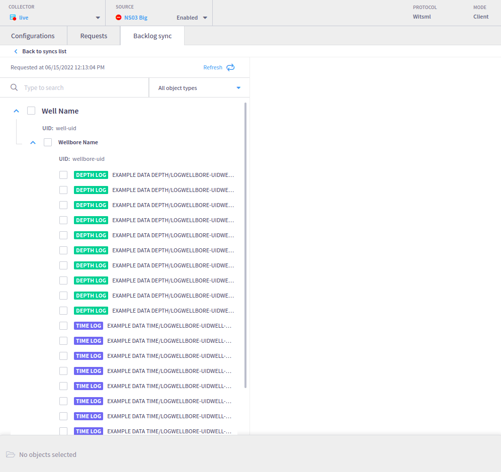
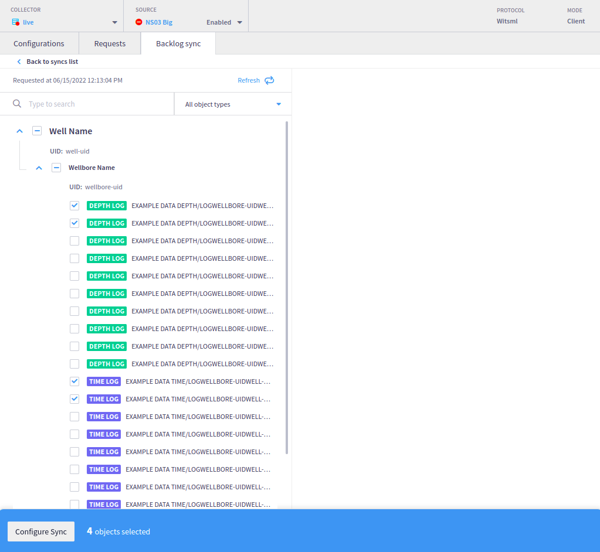
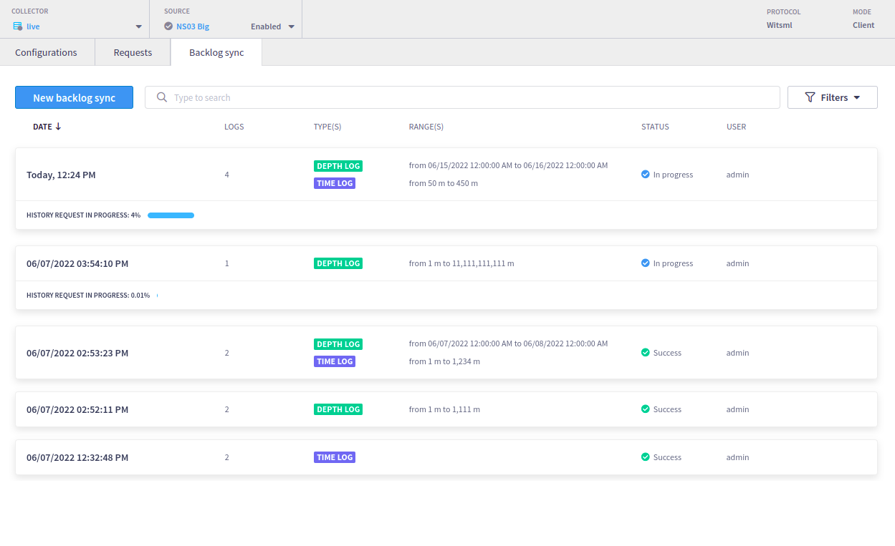

# WITSML Backlog Sync


In order to use this feature, set **`enable_remote_control_backlog_sync`** as **`true`** in the [liverig.properties](../../configuration/liverig.properties.md) file.


When the source is configured to WITSML in the client mode (pulling), the BacklogSync tab will show once the user clicks to edit the source. This feature allows retrieval of time or depth indexed logs data from the WITSML server.

.png>)

Intelie Live will show all the previous backlog sync requests and details of each one.

To create a new request the user has to select the logs from the WITSML tree.





The user will need to select the time or depth logs to retrieve the data.



After selecting which logs will have the data retrieved, the user will need to select the depth interval and/or date time interval. The data retrieval will occur in batches.

The user will specify a data range for depth and/or date time. That range will be used for every WITSML log selected in the batch.



Starting at [LiveRig 4.6.0](../../../whats-new/latest-releases/liverig-4.md#4.6-series), it will be possible to specify both date and time using 30 min intervals for WITSML time logs. Prior to 4.6.0, only dates could be specified.



A new request will be created and the interface will show the progress of each request.



## Troubleshooting

### Stopping a Backlog Sync Request

Once a backlog sync request is started, it will wait until successfully finishes or fails. Today there is no feature to allow the user to cancel a request while it is running. As a workaround, there is a procedure to force the cancellation.

The Liverig Collector keeps all the backlog sync requests' states in files, organized by the WITSML sources, under the Liverig data directory. An example of this structure can be seen in the figure below.


In this example, we can see that there are 3 active backlog sync requests for the source `ns01`. The requests' states are stored within directories `52`, `53`, and `54` for this specific example. The folder number is auto-incremented by the collector whenever new requests arrive.

Inside each of these directories, there is a file named `historyRequestFromRemoteFile`, which contains the request metadata. As an example, let's take a look at the content of the request stored in the folder `52`.


The metadata contains the main information about the request, including the target object identification, the searched range, and the `parentUID` that references the grouped request. This last field is crucial to stop a backlog sync request.

Removing a backlog sync directory will cause the request to be stopped. Ex.: if we remove the directory `0/52`, that request will be removed from the Liverig Collector.

The procedure to stop a backlog sync request is described below:

1. Identifying the requests to be stopped. Run a Pipes query in the Live console to list all the requests you want to remove. Of course, you can add other filters to improve the result. This is a base query.

```bash
 __witsml_remote_request_sync_batch__ request->qualifier:'COLLECTOR_QUALIFIER' request->instance:'COLLECTOR_INSTANCE' request->source:'SOURCE_NAME' request->rigName:'RIG_NAME' event:START
```

The query above will list all the events marking the start of requests related to a source. Ex.:


You can expand the field `request` to confirm which requests need to be stopped.


2. Find the requests within the backlog sync directories structure running the [search\_requests.sh](https://github.com/intelie/drilling/blob/main/.gitbook/assets/witsml\_backlog\_sync/search\_requests.sh) bash script. The script will print a list of directories that contain the searched requests. Ex.:

```bash
$ ./search_requests.sh /opt/liverig/data ns01 470cbff3-962a-4f41-a212-4c352cffa012

Liverig data dir: /opt/liverig/data
Source: ns01
Parent request UUID: 470cbff3-962a-4f41-a212-4c352cffa012

Looking for WITSML backlog sync requests in: /opt/liverig/data/sources/ns01/historyrequests

Result:

/opt/liverig/data/sources/ns01/historyrequests/0/52
/opt/liverig/data/sources/ns01/historyrequests/0/53
```

3. Remove these directories and the requests will be stopped.
4. The last step is to clear the events related to those removed requests. To do that, just use this [Groovy Snippet](https://github.com/intelie/drilling/blob/main/.gitbook/assets/witsml\_backlog\_sync/delete\_requests\_history.groovy) in the "**Live Platform Customizations/Snippets Groovy**", replacing the placeholders with the list of parents' UUIDs.
