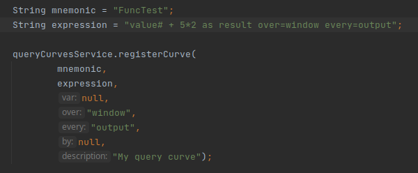
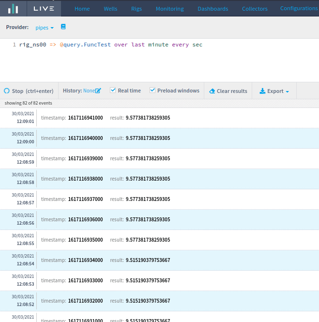

# 3.1.0

### New Features

* Change liverig-parser dependencies to protocols-parser
* Add Modbus source configuration screen [(more)](https://drilling.intelie.com/release-notes/3.1.0#add-modbus-source-configuration-screen)
* Add RAW source configuration screen [(more)](https://drilling.intelie.com/release-notes/3.1.0#add-raw-source-configuration-screen)
* Create API (CollectorResource and Service) to add and edit store.json [(more)](https://drilling.intelie.com/release-notes/3.1.0#create-api-collectorresource-and-service-to-add-and-edit-store-json)
* Create front-end interface to WITSML configured Null Values [(more)](../../administration/high-frequency-data/witsml-null-values.md#screen)
* Add cache to Additional Features configuration to improve performance
* Updated collector sources configuration screen layout [(more)](https://drilling.intelie.com/release-notes/3.1.0#updated-collector-sources-configuration-screen-layout)
* Integrate the new units conversion system into the Live [(more)](https://drilling.intelie.com/release-notes/3.1.0#integrate-the-new-units-conversion-system-into-the-live)
* Experiment with pure systemd unit instead of wrapper
* \[RFC] Allow plugins to register channels with arbitrary queries [(more)](https://drilling.intelie.com/release-notes/3.1.0#rfc-allow-plugins-to-register-channels-with-arbitrary-queries)

### Fixes and improvements

* [Fix Well parameters history does not display units correctly](3.1.0.md#fix-well-parameters-history-does-not-display-units-correctly)
* Autoswitch should not log every change to the normalizer
  * Autoswitch changes are no longer displayed at the Data Management version history, since, conceptually, they are all the same configuration. The only difference is the selected curve.
* Always close the Data Management "Create Template" modal after saving
* Makes the renormalization progress update compatible with async event iterators
* Improvements to WITSML Output Plugin
* \[API] Change `testSourceEndpoint` endpoint to use source object to test and don't call remote control to get the source [(more)](../../collector/remote-control/apis/test-source-endpoint-api.md)
* Cumulative fixes&#x20;
  * From 2.28.6 stable version
    * Do not display a confirmation modal when using Data Management import functionality [(more)](https://drilling.intelie.com/release-notes/3.1.0#do-not-display-a-confirmation-modal-when-using-data-management-import-functionality)
    * Hide Data Management import button if the user doesn't have "manage" permission [(more)](https://drilling.intelie.com/release-notes/3.1.0#hide-data-management-import-button-if-the-user-doesnt-have-manage-permission)
  * From 2.27.2 stable version
    * Fixes "import JSON" font color when using Live 3.1.0 or higher [(more)](https://drilling.intelie.com/release-notes/3.1.0#fixes-import-json-font-color-when-using-live-3-1-0-or-higher)

## Add RAW source configuration screen

Added the RAW protocol option in the collector sources screen, allowing the system to handle RAW based sources servers in the collector from the user interface.&#x20;

.png>)

Read more about the RAW protocol specifications [here](https://drilling.intelie.com/collector/protocols/raw).

## Add Modbus source configuration screen

Added the Modbus protocol option in the collector sources screen, allowing the system to handle Modbus   client based sources in the collector from the user interface.&#x20;

.png>)

Read more about the Modbus protocol specifications [here](https://drilling.intelie.com/collector/protocols/modbus).&#x20;

## Create API (CollectorResource and Service) to add and edit store.json

This feature allows you to add or edit a store.json file via API. We can view the calls created and how you use them.\




View the store.json file



Collector instance



Collector qualifier



```
```





Add or edit the store.json file



Collector qualifier



Collector instance



Set a period to purge tables



Set the size of the WITSML response



Set a list of rig objects, containing the 

`name`

, 

`units`

, 

`tags`

, 

`types`

 and 

`timestamp`

.



URL service used



URL database used



```
```



## Updated collector sources configuration screen layout

The collector sources configuration screen was updated. The fields should be filled from top to the bottom and protocol-specific fields are displayed after the protocol is chosen.

.png>)

Read more about collectors protocols [here](https://drilling.intelie.com/collector/protocols/).

## Integrate the new units conversion system into the Live

Former in LiveRig 3.0, the units created at the Unit Management Tools screen was not available to the rest of the Live. Starting at 3.1, the new units conversion system is integrated into the Live and can be used at the normalization, dashboards, and most of screens where units are available, such as Display Units, Standard Channels and Data Management. The only exceptions are the Well and Rig Parameters tabs.

The unit conversion can also be handled in Pipes queries using the function `curve_unit_convert`. This way, we discontinued the experimental Pipes function `temp_curve_new_unit_convert` previously available in LiveRig 3.0.

### Side effects of deleting and renaming&#x20;

At last, it's important to mention the known side effects of deleting or renaming a unit alias or an extension, or deleting a conversion.

#### At "Standard Channels" and "Calculated Channels"

The unit is no longer recognized by Live, and, then, will be displayed with a warning layout.

.png>)

**At "Data Management"**&#x20;

If a conversion, unit alias, or extension that is being used to "Data Management" is deleted or renamed, the interface and the normalization threads the unit as Unknown

**At "Display Units"**

If a unit alias or a unit extension that is being used at Display Units, and is deleted or renamed, dashboards that use this "Display Units" will fail:

.png>)

And the Display Units will prevent the user from saving until the unit is changed to a known one:

.png>)


## Fix Well parameters history does not display units correctly

Well parameters version history used to show the current units, instead of the selected version units. The bug has been fixed, and now units are displayed correctly depending on the selected version.

## Do not display a confirmation modal when using Data Management import functionality&#x20;

The following modal is no longer displayed when importing a JSON in the Data Management screen

.png>)


## Hide Data Management import button if the user doesn't have "manage" permission

Now, the import button is hidden when the user doesn't have permission to manage the asset.

.png>)

## Fixes "import JSON" font color when using Live 3.1.0 or higher

When using Live 3.1.0, some characters used at the import JSON code input didn't have a color:

.png>)

After the fix, the correct color is applied:

.png>)

## \[RFC] Allow plugins to register channels with arbitrary queries

This feature adds a new curve, the `query curve`. The `query curve` can be considered an extension of the calculated channels, allowing you to **create advanced calculations using pipes functions**, such as aggregation, span, period and other features of the pipes.\



Discussion notes


* API created only in the backend, having no persistence in the settings.

### How to add a query curve.



### How to call a query curve.


