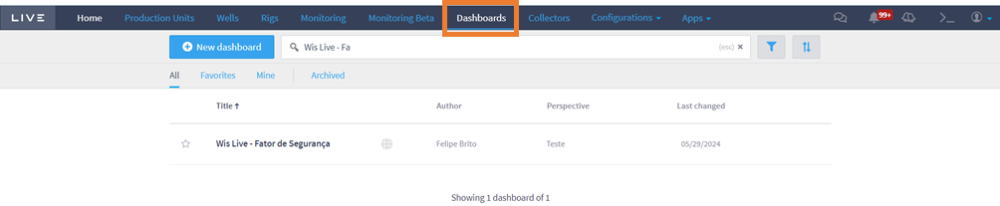
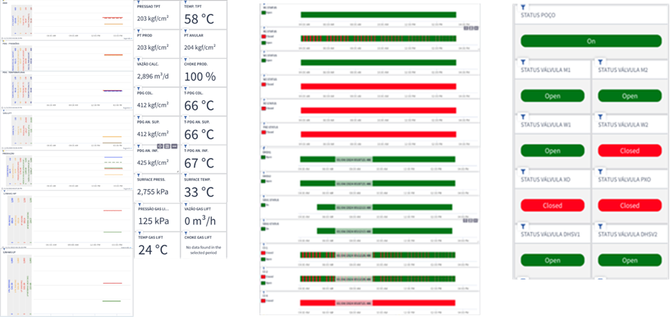
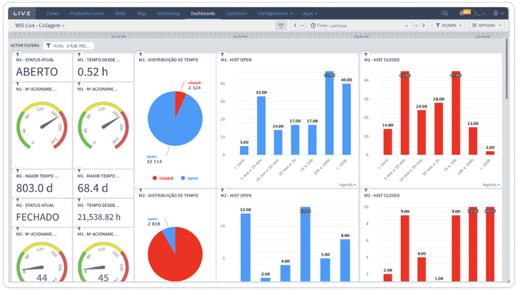

# Production Unit Integrity

Through dashboards, the user can monitor the integrity and production of wells through 2 main existing dashboards. To access both dashboards, click on Dashboard in Live's horizontal bar, then type in the desired dashboard in the search box and click on the desired dashboard to access it. Below is an example where the user searches for the Security Factor Dashboard:

<figure><figcaption></figcaption></figure>

Currently, you can access two dashboards for monitoring well integrity and production. These are Security Factor and Valve Cycling.

### Security Factor

Its purpose is to monitor the production and integrity of a production or injector well, using information from sensors (PDG, TPT, TP, etc.) and valves (ANM, DHSV, CI, etc.) that allow you to measure the status of valves, pressure and temperature and calculated flow, in order to guarantee the integrity of its components. To access it, simply search for the name Wis Live - Security Factor (Fator de Segurança). The figure below shows a view of the Security Factor dashboard.

<figure><figcaption></figcaption></figure>

### Valve Cycling

Its purpose is to allow users to monitor the cycling of well valves (ANM, DHSV, CI, etc.) according to the limit indicated by the manufacturer. It assists in checking the cycling limit of well valves and in predictive maintenance. To access it, simply search for Wis Live - Valve Cycling (Ciclagem de Válvulas). The view of the Valve Cycling dashboard is shown below.

<figure><figcaption></figcaption></figure>
