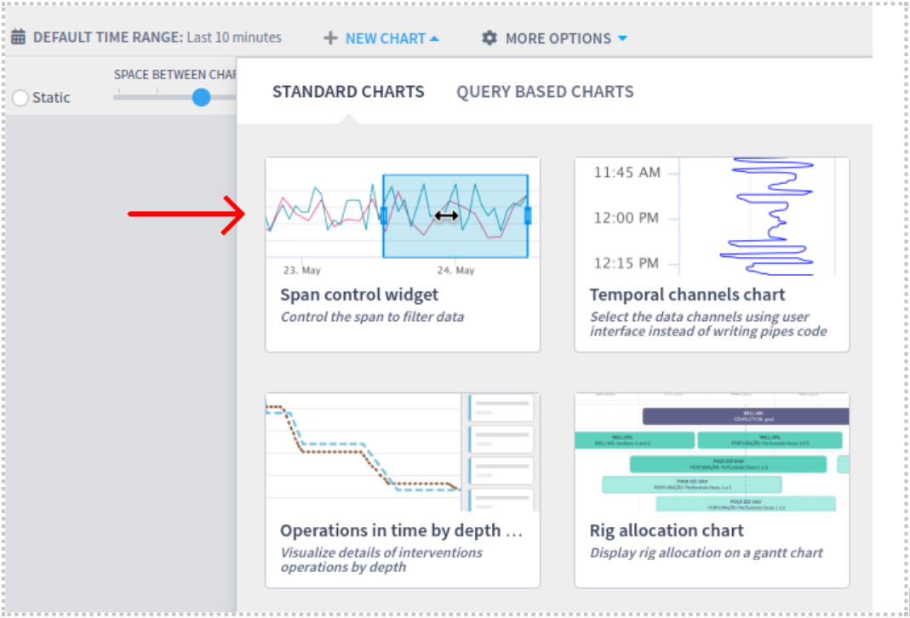
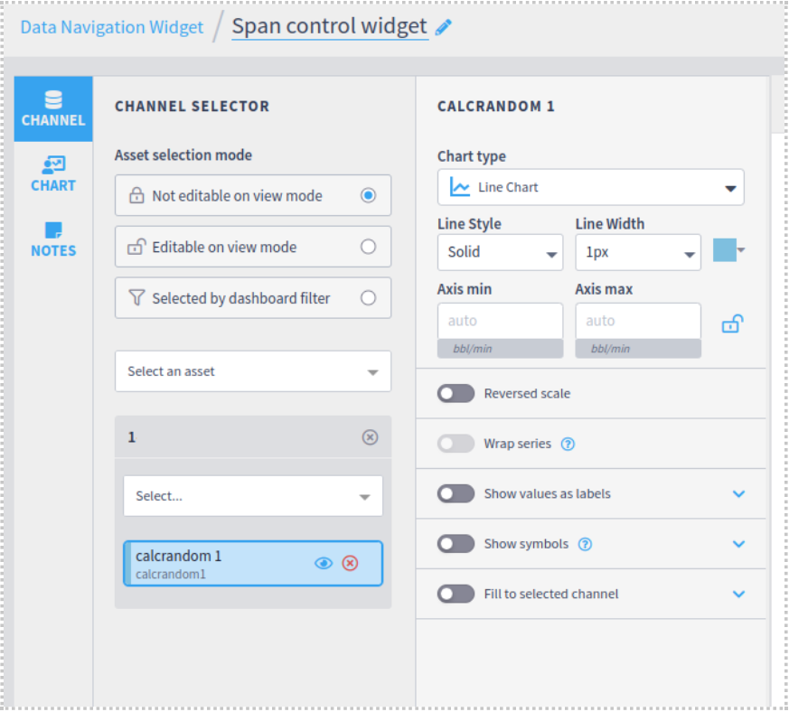
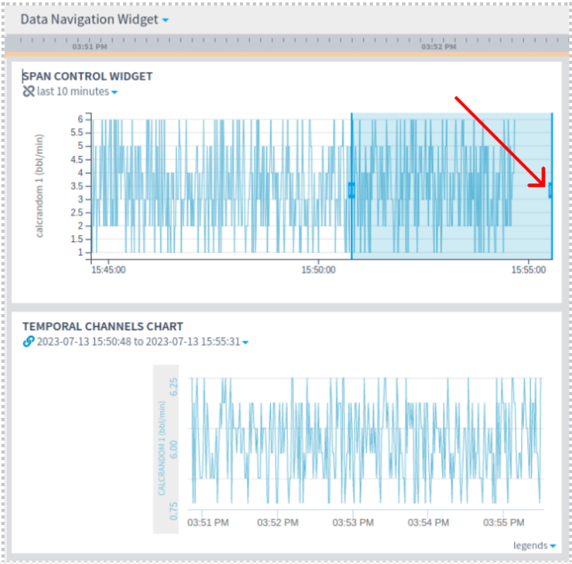
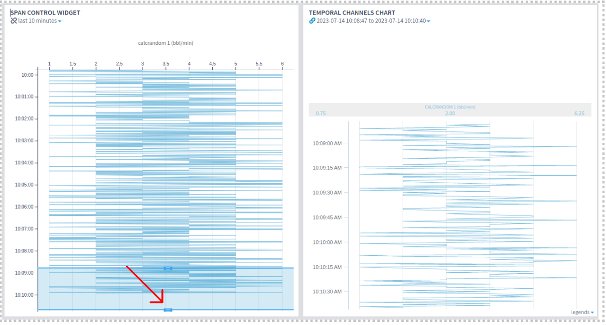
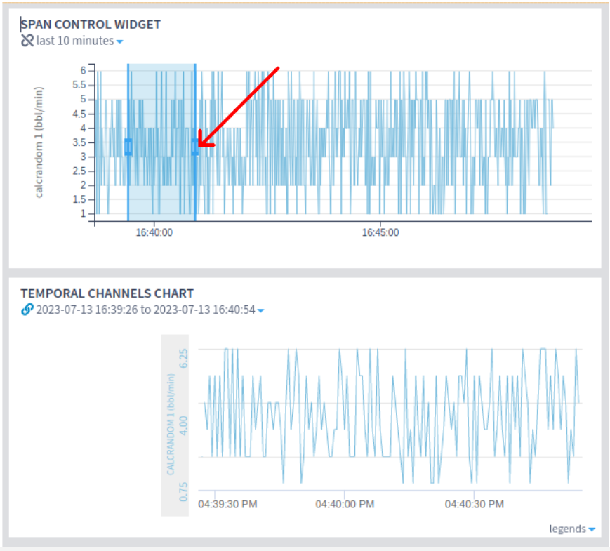
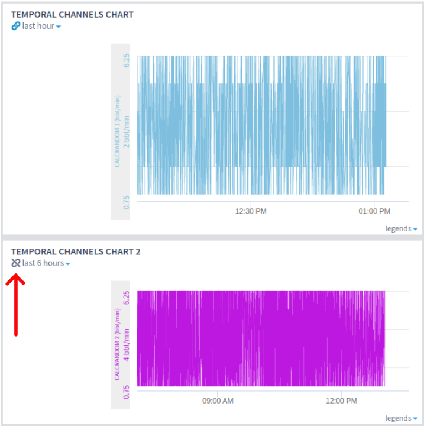
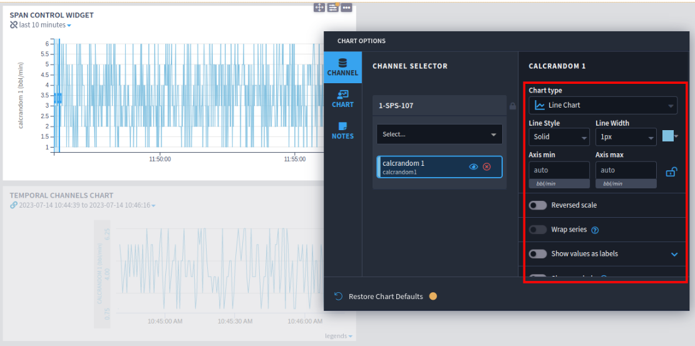
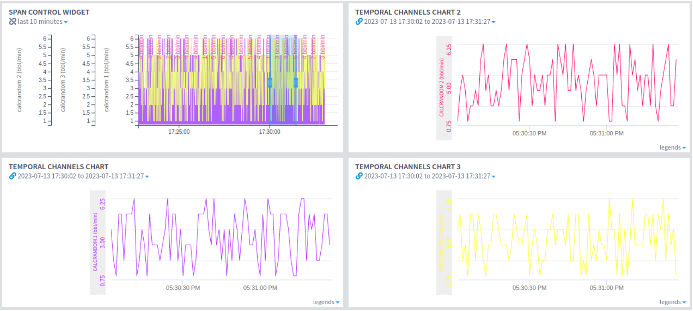

# Span Control

The span control widget allows users to navigate fluidly though the beginning and end of the dashboard chart data, making it possible to browse over a larger period of events to find points or ranges of interest and then visualize this smaller range in **pipeless temporal channels widgets**, providing a faster way to manipulate the span and reducing the user’s wait time when analyzing specific time ranges.


This functionality requires [plugin-live-exploratory-viz](https://marketplace.intelie.com/artifact/plugin-live-exploratory-viz/) (1.3.0+), [plugin-liverig](https://marketplace.intelie.com/artifact/plugin-liverig/) (5.3.0+), [plugin-assets](https://marketplace.intelie.com/artifact/plugin-assets/) (5.3.0+) and [Live-ui](https://marketplace.intelie.com/artifact/live-ui/) (3.32.3+) plugins. They are available on the [marketplace](https://marketplace.intelie.com/)



This functionality affects all **the temporal channels widgets in the dashboard**.


## How to use

1 - Adding a new span widget in a dashboard:

* On the new chart menu, select span control widget.

2 - Select the asset selection mode, the asset, channels and chart configurations, then save and go back to dashboard.

3 - After the span control widget is added to the dashboard, add a temporal channels widget. With both widgets on the dashboard, move the blue draggable handler to select the desired range.

* For real time data visualization, the right blue handler should be dragged to the end of the chart.

* If the chart orientation is set to vertical, the right blue handler should also be dragged to the end of the chart.

* For historical data visualization, the right blue handler should be dragged anywhere before the end of the chart.

* If the chart orientation is set to vertical, the right blue handler should also be dragged anywhere before the end of the chart.

4 - Temporal channels widgets will only reflect the span control widget’s selection if the “follow the dashboard’s span” option is switched on. This option defines if the widget’s timespan will be linked with the dashboard's timespan. By default, when a new widget is created, this option is switched on.

* If the widget’s timespan is changed manually, it will automatically stop being linked to the dashboard’s timespan and will stop reflecting the span control widget’s timespan.

## Available features

When configuring the span control widget, some customization options for [channels temporal](https://drilling.intelie.com/features/data-visualization/channels-charts/temporal-channels-chart) widgets are also available for this widget.

