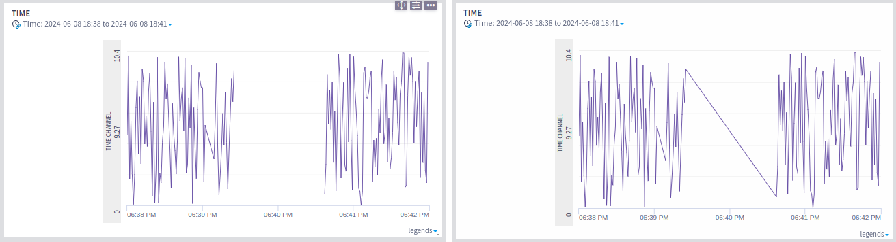
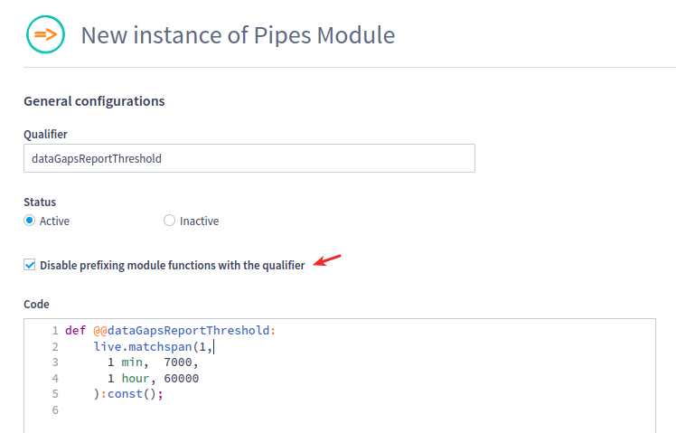

# Temporal Channels Chart

.png>)

Many visual options are available on the `Chart` tab, as shown on the image below.

.png>)

## Plot fills between multiple channels

In case of multiple channels (even from multiple assets) in the same widget, it's possible to specify to fill the area between the curves when they get crossed, in both positive and negative values. This feature can be helpful to enlighten the user about the difference between the values.


The configuration for the other channel to be compared and how to fill the positive and negative differences is available in **Widget Chart Options** menu at right top of each widget.

.png>)

## Stacked area charts

A stacked area chart displays the evolution of a numeric variable for several groups of a dataset. Each group is displayed on top of each other, making it easier to read the evolution of the total.

Comparing the heights of each segment of the curve allows us to get a general idea of how each subgroup compares to the other in their contributions to the total.

.png>)

On the **Widget Chart Options** menu, after clicking on the stacked chart icon, the following option is available:

* Stroke style and width: Sets different stroke styles and widths for the current channel.

.png>)


Important note:

Channels with different units can be added on the same stacked chart, but the user will receive a warning message.


.png>)

Different types of charts can be added on the same visualization, as shown on the image below:

.png>)


Important note:

As this chart type focus on the relative comparison between the channels, the channel ordering functionality is not available on stacked charts.


## Customizing data gaps report threshold for temporal channels charts

If "Report data gaps" feature is enabled in a Live environment, all temporal and depth channels charts in this environment will display data gaps according to the "data gaps time threshold" configuration.



The above picture shows the same chart in a Live environment with data gaps feature enabled (left), and disabled (right). Note that in the picture at the left, 2 points that have a time interval bigger than the "data gaps threshold" are no longer connected.

The "data gaps time threshold" can be configured at Live administration, and only allows a value, in ms. Sometimes, for a temporal channels chart, the developer may need more expressiveness, for example, defining the threshold based on the dashboard timestamp, or defining the threshold matching the `@@assetWidgetOverrideFilter` conditionals.

In these cases, the developer can define the macro `@@dataGapsReportThreshold`. One way of doing so is creating a pipes module. For example:



Make sure to turn the options "Disable prefixing module functions with the qualifier" on.

This other example defines the data gaps report threshold depending on the event type of the filtered asset:

```
def @@dataGapsReportThreshold:
  @@lookup.asset_name_event_type[0] == "rig_Test" ? 60000, 2000:const();
```
