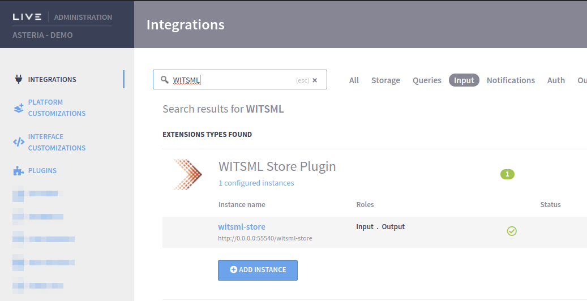

# WITSML Store


WITSML Store plugin is available at [https://marketplace.intelie.com/artifact/plugin-witsml-store](https://marketplace.intelie.com/artifact/plugin-witsml-store/).


Intelie WITSML Store implements the [WITSML standard](https://www.energistics.org/witsml-data-standards/) as defined by [Energistics](https://www.energistics.org/) and it's compliant with the [WITSML 1.4.1.1 API](http://w3.energistics.org/schema/WITSML\_v1.4.1.1\_Data\_Schema/witsml\_v1.4.1.1\_data/index\_witsml\_schema.html).

.png>)

### Key features

* WITSML objects availability
  * All 26 objects for WITSML 1.4.1.1 protocol version
  * 20 objects for WITSML 1.3.1.1 protocol version
* Fully integrated to [Intelie Live normalization engine](../data-flow/data-normalization/)
  * Automatic data normalization configuration when a well is added
  * Normalized data displayed as WITSML logs for both date-time and depth
  * Native support for unit conversion over the data ingested
* Enables the WITSML reading for legacy wells (created for LiveRig Collector data flows)
* Well Asset selection for legacy compatibility
* Channel-limits detection for raw log objects
* Enables the setup of centralized WITSML datahubs
* Agnostics in the underlay storage system based on [Intelie Live storage provider](https://platform.intelie.com/developers/backend-api/storage-providers) extensibility
* Native data replication features for federated installations (Edge <-> Cloud or Cloud <-> Cloud)
* Fully prepared to scale up
  * Maximum parallel requests processing configuration
  * Queue size configurations to ensure the data retention
  * Safe and efficient data transmission through LiveRig Collector binary protocol
* Replay and audit capabilities to enable operational troubleshooting
* Fully integrated to [Intelie Live authentication and authorization layers](https://platform.intelie.com/features/access-permision)

