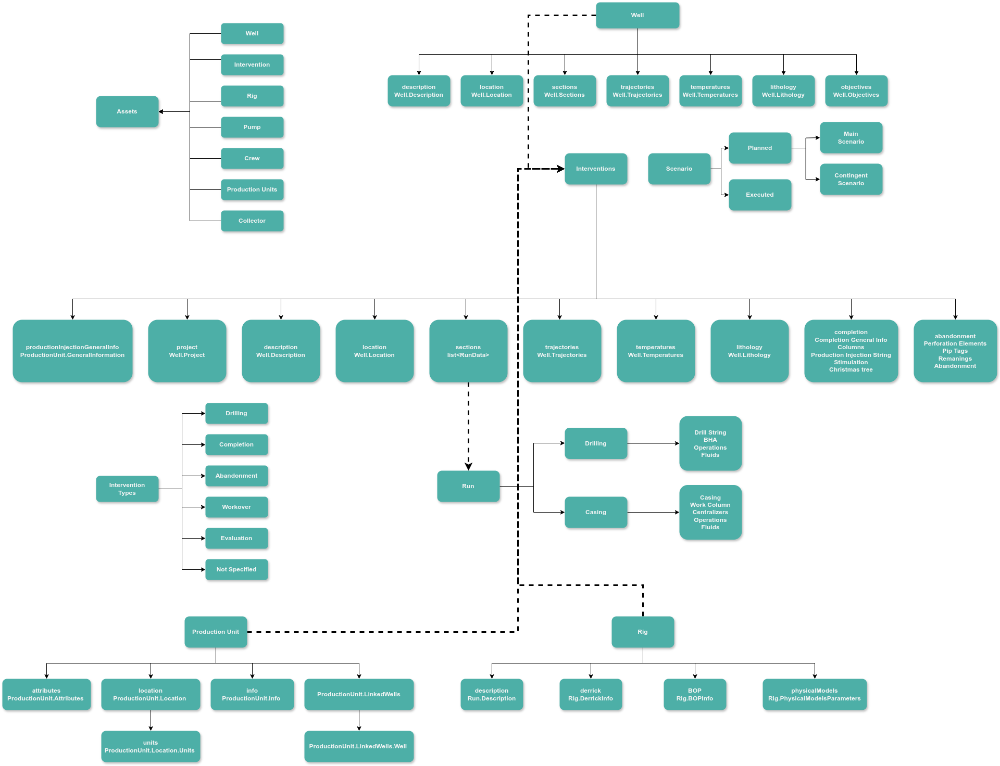

# Assets Structure

Live can store and represent structured static data for wells, rigs, and interventions:

More information about each schema can be found on [Well Schema](../well/well-schema.md), [Intervention Schema](../intervention/intervention-schema.md), and [Rig Schema](../rig/rig-schema.md)
