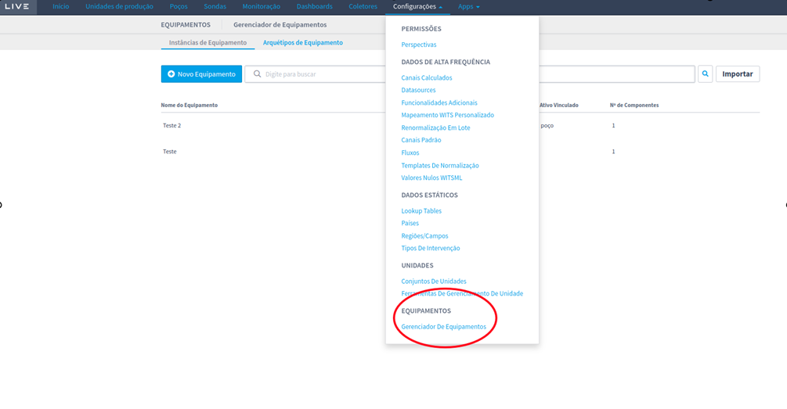

# Equipment

Assets can be associated with one or more asset types, given the limits of each of their components and managed via the Equipment Manager plugin.

To access the equipment and archetype management page, you need to go to the Settings section and click on the Equipment Manager option. The figure below shows the Settings menu that allows you to access the equipment manager.

<figure><figcaption></figcaption></figure>
