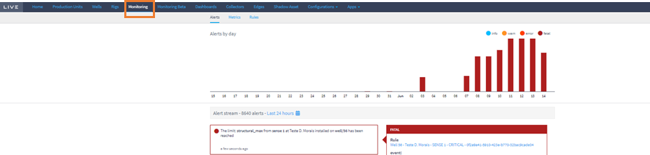
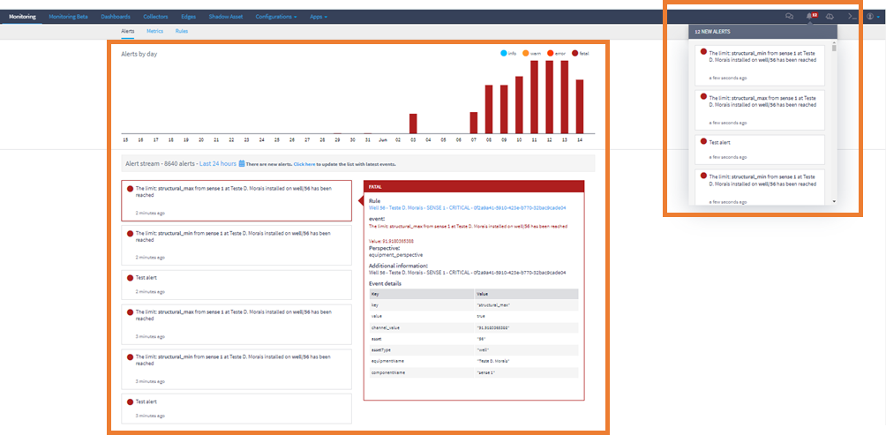
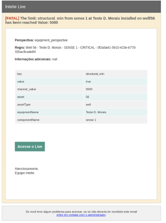

# Alarms

Once the alarms have been registered in the archetypes and equipment instances, the user starts receiving the alarms the moment the channel starts receiving data. To monitor them, the user must enter Live Monitoring. Figure below shows where you need to go to access the initial alarm monitoring screen.

<figure><figcaption></figcaption></figure>

#### Monitoring alarms

Registered alarms are received in real time on Live and there are two ways to monitor them. Through Live and by receiving emails.

In Live, each monitored alarm is reported in the information bell or directly through the Monitoring plugin. As shown in figure below, on the left-hand side are the alarm notifications received by the information bell and, in the center, detailed information about the alert received and its level of criticality.

<figure><figcaption></figcaption></figure>

In addition, critical alarms are sent by Live to the user in the form of an e-mail, Slack or Teams. Figure below shows the e-mail template sent by Live.

<figure><figcaption></figcaption></figure>
