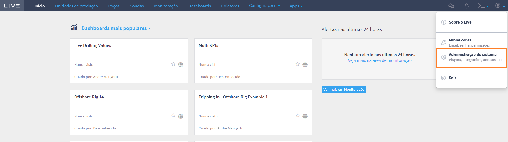
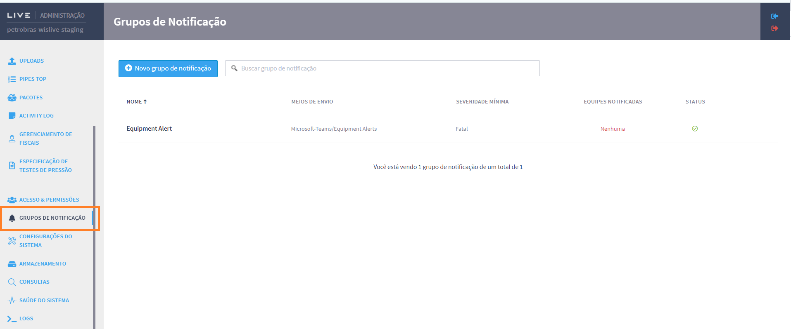
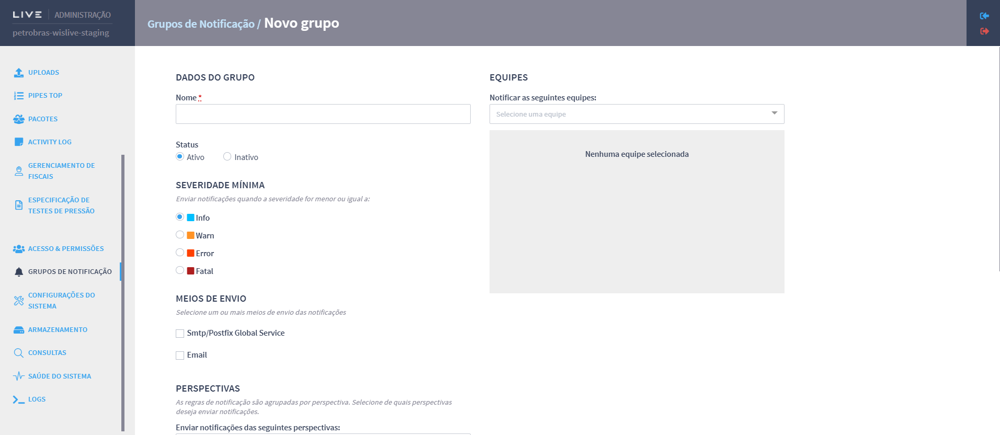

# Configuration of notification group by external application

The settings for sending notifications via external channels are made in the admin panel in the Notifications Group section (url: /admin#notifications). To set up a new group, you need to access the Live configuration area. To do this, you need to access the user's profile and then click on System Administration, as shown in figure below.

<figure><figcaption></figcaption></figure>

Next, the user must click on Notification Groups in the menu on the left-hand side of Live's settings. Figure below shows the initial screen of the Notification Group that must be accessed in order to register the group of users who will receive external notifications of the registered alarms.

<figure><figcaption></figcaption></figure>

To create a new group, click on New notification group and fill in the information required to register a new group. To do this, the user must enter the name, status, criticality level to be monitored, communication channel, prospects and teams. Figure below shows the screen for registering a new notification group.

<figure><figcaption></figcaption></figure>
