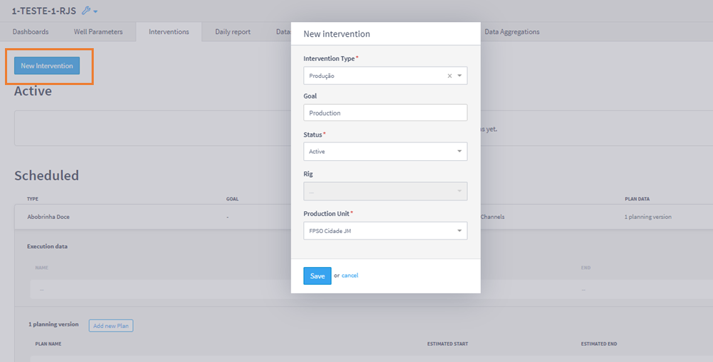
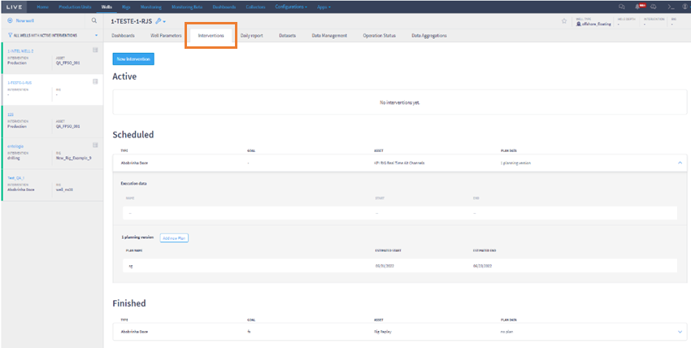

# Intervention Relations

In order to relate wells to rig/production units, interventions need to be created. To do this, access the page of the well of interest from the Wells plugin and then click on the Interventions tab. In this tab, the user will have access to all the well's completed, planned and active interventions. The figure below shows the home page of the Wells plugin's Interventions tab.

<figure><figcaption></figcaption></figure>

In the figure below, the user must click on New Intervention, shown by the orange rectangle, and will then have access to the screen for registering a new intervention.

<figure><figcaption></figcaption></figure>

After the user enters the desired production intervention characteristics and saves, the new intervention will be created with the desired status.
