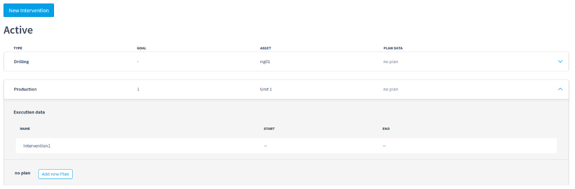
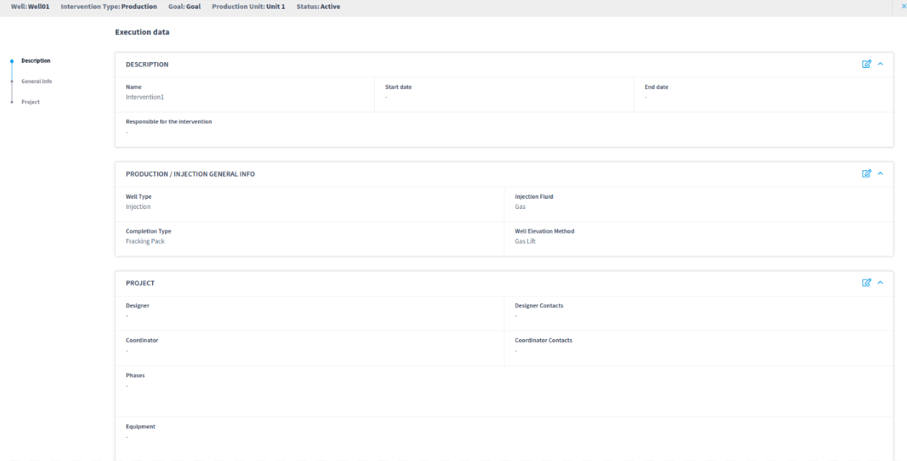
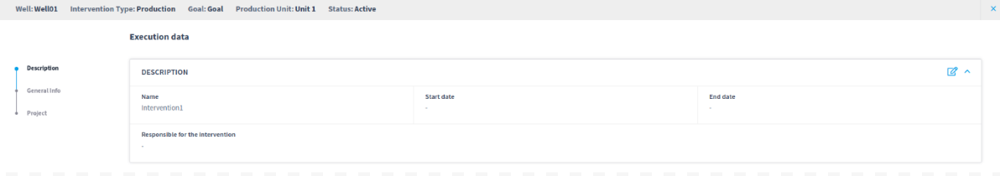
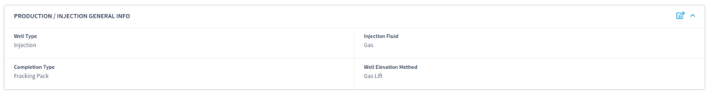
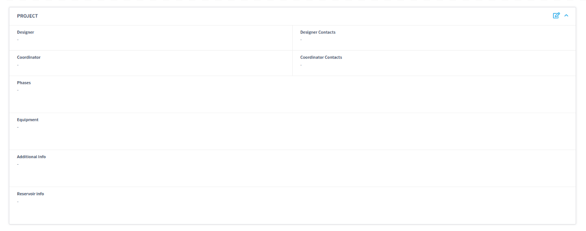

# Production

Live provides structured production intervention data to manage well lifecycle.&#x20;

<figure><figcaption></figcaption></figure>

Since the production data is not related to the drilling lifecycle, the well can have a active production and drilling intervention.

<figure><figcaption></figcaption></figure>

#### Description

Live provides basic information of the production unit intervention with the name, start/end date and the responsible for the intervention. This information can be defined in the intervention execution data modal, in the description section.

<figure><figcaption></figcaption></figure>

#### Production / Injection General Info

Live provides production and injection general information of the production unit intervention with Well Type, Injection Fluid, Production Fluid, Completion Type and Well Elevation Method. This information can be defined in the intervention execution data modal, in the production/injection general info section.

The Production Fluid/Injection Fluid selector will change based on the Well Type value selected.

<figure><figcaption></figcaption></figure>

#### Project

Live provides basic project information for the production intervention with Designer, Designer Contacts, Coordinator, Coordinator Contacts, Phases, Equipment, Additional Info, Reservoir info.

<figure><figcaption></figcaption></figure>
