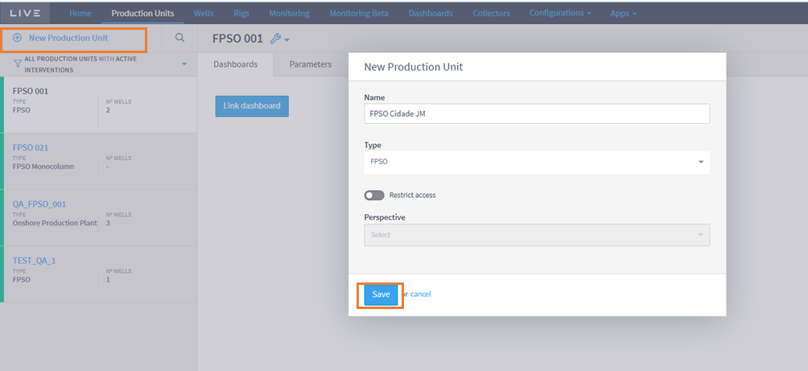
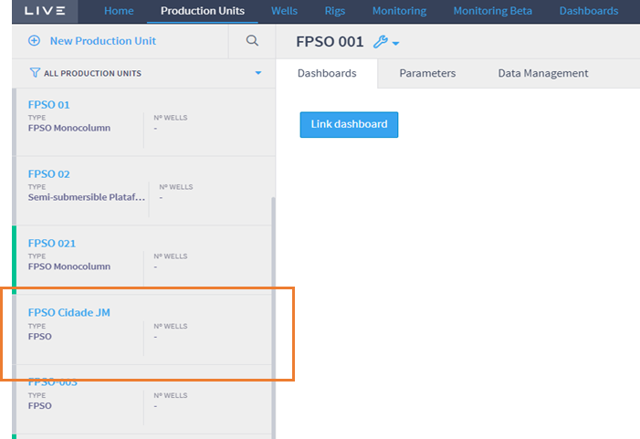
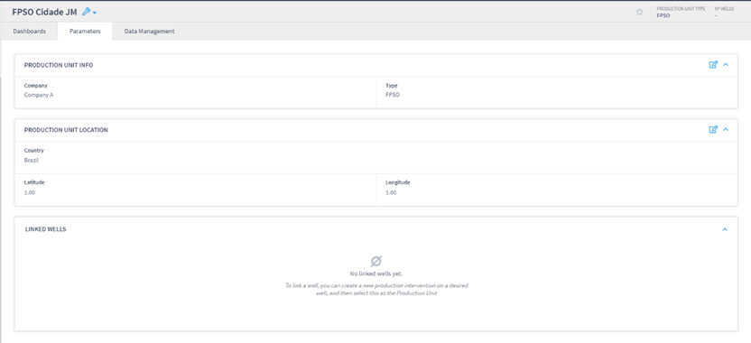

# Creating of Production Unit

To register a production unit, the user must enter the name of the production unit, its type and the access perspective (if necessary). Figure below shows where to click to create a production unit. The orange rectangle on the left-hand side of the screen is where the user must click to open the initial registration screen.

<figure><figcaption></figcaption></figure>

Finally, after filling in the necessary fields, the user must click on the Save button and the new production unit will appear in the control panel on the left-hand side of the plugin's home screen. Figure below shows the panel displaying the new “FPSO Cidade JM” production unit, with an inactive status and no associated well.

<figure><figcaption></figcaption></figure>

Note that in the right-hand corner you can see information on the type of production unit and the number of wells associated with it. Note that none of the Production Units have associated wells, which are indicated with a “-”. Section 2.3 gives details of how to associate a well with a production unit.

Once you have selected the production unit, you can add the information you want. To do this, simply click on the Parameters tab. Figure below shows the Parameters tab with the production unit and location information filled in and no well associated with it yet.

<figure><figcaption></figcaption></figure>
