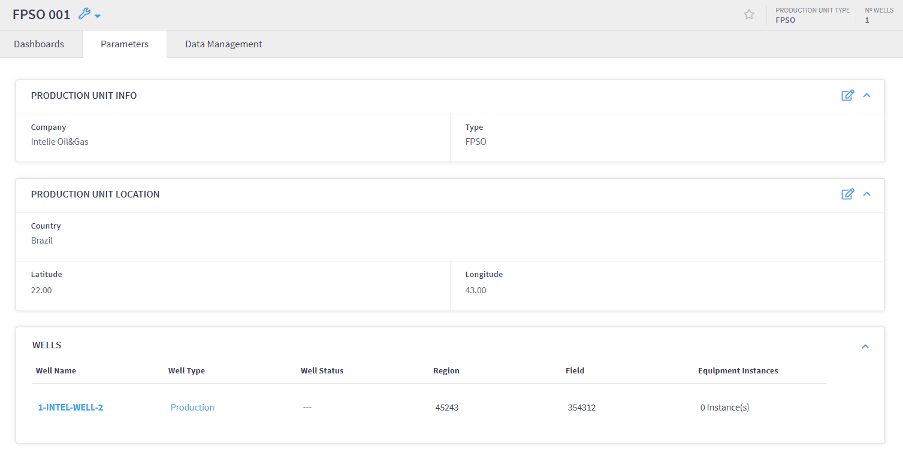
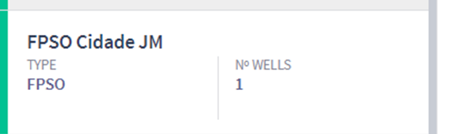

# Linking Wells to Production Units

For a well to be associated with a production unit, it must be in the production or injection phase. In order to associate a well with a production unit in the WPM plugin, the well must have an active production intervention.

To add and link a new intervention of the production type, you can create an intervention with this type by following the steps on the[Intervention page](../intervention/intervention-relations.md), it must be created using Active status. The association is made automatically after creation. To see the information on the wells associated with a production unit, you need to return to the WPM plugin and access the desired production unit. Figure below shows how the information on the wells associated with the production unit is displayed.

<figure><figcaption></figcaption></figure>

The well association table contains a summary of the well, with the following fields:

* Well name;
* Well type: Producer or Injector
* Well status: Open or Closed
* Region; and
* Field.

If you want to see the details of any of the wells associated with the production unit, just click on the well and Live will open the well information screen. Also, note that there will now be an intervention associated with the production unit. Figure below shows the summary panel with 1 well associated with the production unit and its Status changed to active.

<figure><figcaption></figcaption></figure>

In addition, this flow must be carried out for all wells belonging to a production unit. Also note that if a production intervention is entered with a status of planned or completed, that well will not appear associated with the production unit.
