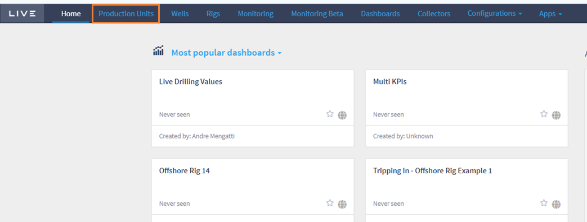
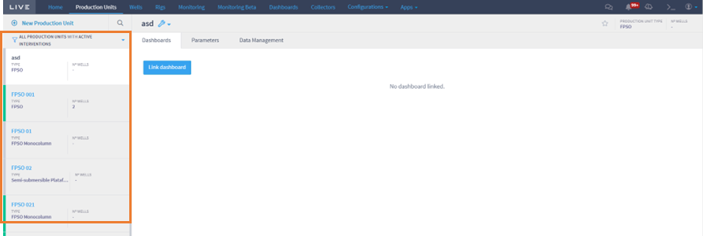
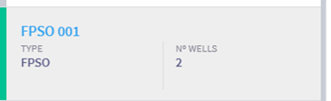
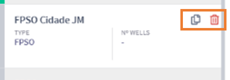
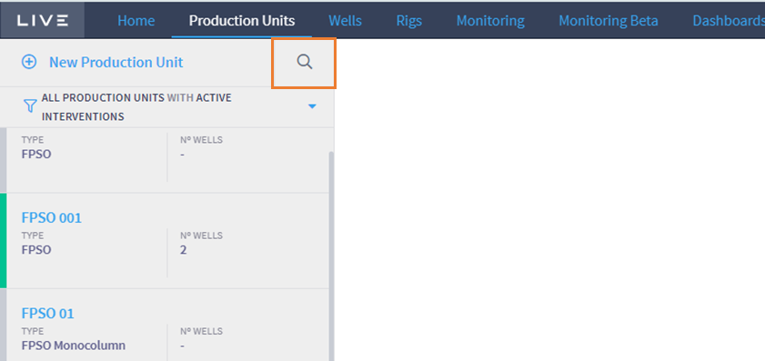
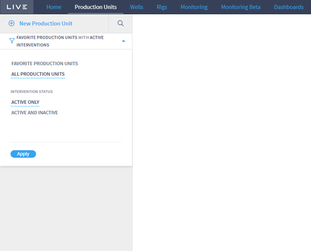

# Plugin Access

When you access Live, the new Well Production Units (WPM) plugin will be available in the top bar under the name Production Units. Figure below shows how to access the home page of the WPM plugin by clicking on the Production Units link.

<figure><figcaption></figcaption></figure>

On clicking, Live will open the production units control page. Here you can register a new production unit and manage all the units already registered. Figure below shows the production units control panel on the left.

<figure><figcaption></figcaption></figure>

The following information is provided for each production unit already registered:

* Type of production unit, which can currently be:
  * Fixed platform;
  * Semisubmersible platform;
  * FPSO;
  * Monocoluna FPSO;
  * TLP; and
  * Onshore Production Plant.
* Number of Wells: Number of wells associated with the production unit.
* Unit Status: Green if there is any active production intervention, gray if there is no active intervention.

Figure below shows an example of a production unit registered as “FPSO 001”, which is of the FPSO type, has 2 associated wells and has the Status active.

<figure><figcaption></figcaption></figure>

By hovering over the desired production unit, the user can also copy or delete the production unit. Figure below shows these options, the first item being to duplicate and the second to delete.

<figure><figcaption></figcaption></figure>

Note that only production units with an Inactive status can be deleted.

In addition, it is possible to filter the desired Production Unit. The user can choose to type in the name of the Production Unit by clicking on the magnifying glass shown in Figure below and typing in the desired name. Another way to filter is to choose between the following options:

* Favorite Production Units or All Production Units; and
* Unit status by choosing between Active Only or Active and Inactive.

<figure><figcaption></figcaption></figure>

Once the desired options have been chosen, the user must select Apply to see the production units that have these specifications. Figure below shows the plugin's filter panel.

<figure><figcaption></figcaption></figure>
