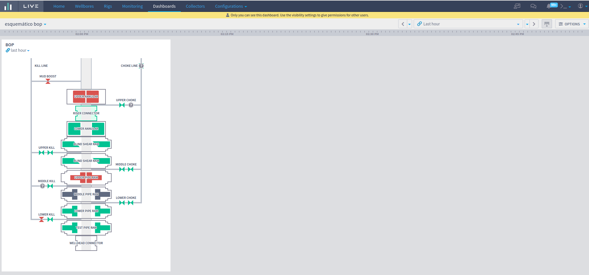

# BOP Schematic

The BOP Schematic feature provides the interface to show the BOP schema and track your components status in real time.

.png>)

A BOP Schematic is always associated with a Rig, so it is created and edited in the Rig parameters, at the BOP Configuration area.

.png>)

The BOP schematic widget is where the configured schema, with real time status of the components, will be displayed.

Now, see how to configure a BOP Schematic and how to properly use all the features of this tool.

### **How to configure from Schematic BOP**&#x20;

At the rig parameters tab it is possible to configure BOP for each rig:

.png>)

Clicking on the edit button of the BOP configuration card will open a new window where is possible to start a new BOP from basic template or import from another rig or JSON files.

### **Starting from basic template**

When starting from a basic template, it starts with two fixed components, Kill/Choke and Mud Boost, present in all other schemes:

.png>)

Clicking in “ + Add Component ” a new component will be appended in the schematic and the configuration screen will open with the options to configure:

.png>)

The component in the left side automatically changes while the Component Details are defined at the form in the right like the component and its type and name:

.png>)

The status of the components can be controlled by the annotations. The Component Data area, at the right, is where the “Source of data” and “Status allowed” are defined. For now, only the annotations are enabled as source of data:

.png>)

Is also possible to reorder the components by clicking and dragging on the handler icon. After changes, save the BOP Schematic by clicking on the Save button:

.png>)

The BOP Schematic will be displayed in the rig parameters. At this point, in the rig parameters, the status of the components are not displayed yet. For that it is necessary to open the schematic inside the BOP Schematic Widget.

.png>)

### **Exporting Schematic BOP**&#x20;

To export the Schematic open the edit screen and click on Export:

.png>)

Choose the type you want to export and Save. The file will be automatically downloaded.

.png>)

For now, only the JSON format is enabled to export.

### **Importing Schematic BOP from another rig**&#x20;

To import BOP Schematic from another Rig, go to the Rig you want to configure, click to edit BOP Schematic and click on the Import button.

.png>)

At the import modal, select “Copy configuration from another rig”, then select the rig you want to import the data, and click to import.

.png>)

.png>)

The schematic imported will be displayed in the edit mode. To save the changes click on the Save button.

### **Importing Schematic BOP from JSON**&#x20;

To import BOP Schematic from JSON, go to the Rig you want to configure, click to edit BOP Schematic and click on the Import button.

.png>)

At the import modal, select “JSON”. It is possible to drop a file or paste the JSON from the clipboard. If JSON is valid, click "Import", check the configuration you just imported and then click "Save".

### **BOP Schematic Widget (real time component status)**&#x20;

To include the chart go to edit mode at the dashboard and the option for BOP schematic widget will be available

.png>)

It is possible configure the chart to select the rig by available rigs list

.png>)

You can also configure the visibility of component names. They can be always visible or only visible when the cursor is over a component.

.png>)

If there's no annotation status for the selected rig, the schematic represents the components as 'no data', like the image below:

.png>)

### **How to update status using annotations**&#x20;

At the dashboard, click on the timeline, select "+ Create" and then select "Register BOP status":

.png>)

In the next screen it is possible to select the desired rig and well. If the selected rig has no components registered, as per previous steps, no component will be displayed and the note cannot be saved.

If the rig has components registered, the list of components **with defined data source** will be present in the list:

.png>)

Select the state for each of the components and click save. After saving, the note will be highlighted in the timeline. Clicking on this indicator will display the basic information of the note.

.png>)

For more information about BOP Status register access [https://drilling.intelie.com/whats-new/bop-status-register](bop-status-register.md)
