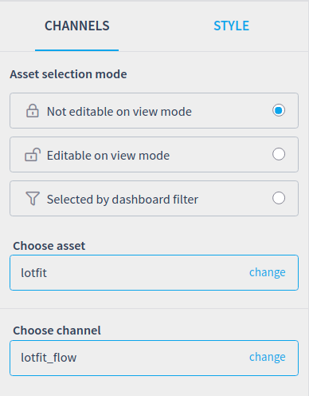
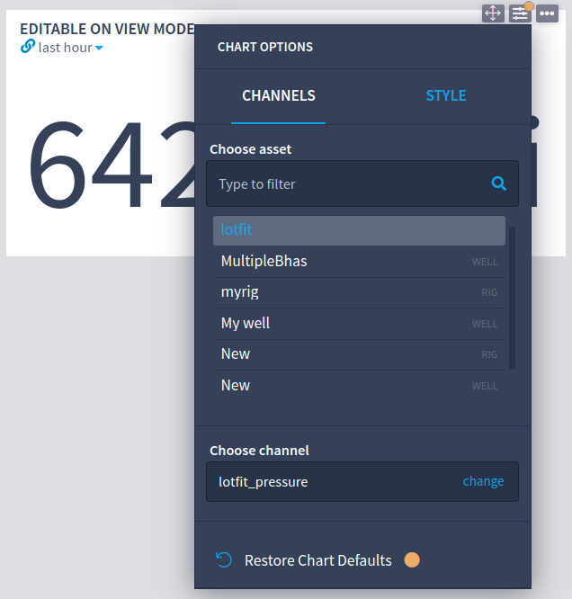
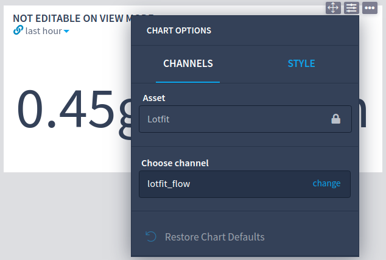
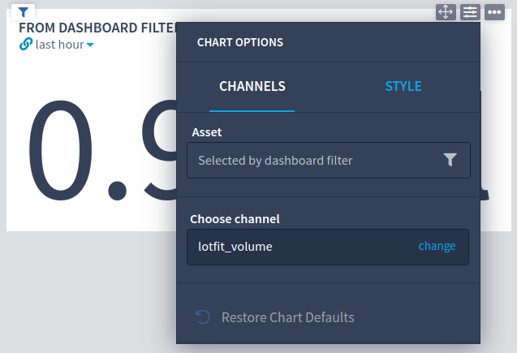

# Latest releases


The complete list of plugins for the **Live Drilling** solution is now categorized and published into the **Intelie Live Marketplace**, see: [https://marketplace.intelie.com/search/category/O\&G%20Drillin](https://marketplace.intelie.com/search/category/O\&G%20Drilling/)\*\*\*\*


***

## **Dez. 30th 2022**

* **plugin-liverig 5.0.0, 4.10.1, 4.9.2, 4.8.3 (**[**more**](https://marketplace.intelie.com/artifact/plugin-liverig/)**)**
* **plugin-assets 5.0.0, 4.10.1, 4.9.2, 4.8.3 (**[**more**](https://marketplace.intelie.com/artifact/plugin-assets/)**)**
* **liverig-collector 5.0.0, 4.10.1, 4.9.2, 4.8.3 (**[**more**](https://marketplace.intelie.com/artifact/liverig/)**)**

## **Dez. 12th 2022**

* **plugin-liverig 4.10.0, 4.9.1, 4.8.2, 4.7.3 (**[**more**](https://marketplace.intelie.com/artifact/plugin-liverig/)**)**
* **plugin-assets 4.10.0, 4.9.1, 4.8.2, 4.7.3 (**[**more**](https://marketplace.intelie.com/artifact/plugin-assets/)**)**
* **liverig-collector 4.10.0, 4.9.1, 4.8.2, 4.7.3 (**[**more**](https://marketplace.intelie.com/artifact/liverig/)**)**

## **Nov. 11th 2022**

* **plugin-liverig 4.9.0, 4.8.1, 4.7.2, 4.6.4 (**[**more**](https://marketplace.intelie.com/artifact/plugin-liverig/)**)**
* **plugin-assets 4.9.0, 4.8.1, 4.7.2, 4.6.4 (**[**more**](https://marketplace.intelie.com/artifact/plugin-assets/)**)**
* **liverig-collector 4.9.0, 4.8.1, 4.7.2, 4.6.4 (**[**more**](https://marketplace.intelie.com/artifact/liverig/)**)**

## **Oct. 24th 2022**

* **plugin-liverig 4.8.0, 4.7.1 (**[**more**](https://marketplace.intelie.com/artifact/plugin-liverig/)**)**
* **plugin-assets 4.8.0, 4.7.1 (**[**more**](https://marketplace.intelie.com/artifact/plugin-assets/)**)**
* **liverig-collector 4.8.0, 4.7.1 (**[**more**](https://marketplace.intelie.com/artifact/liverig/)**)**

## **Aug. 19th 2022**

* **plugin-liverig 4.6.1, 4.5.4, 4.4.4, 4.3.6 (**[**more**](https://marketplace.intelie.com/artifact/plugin-liverig/)**)**
* **plugin-assets 4.6.1, 4.5.4, 4.4.4, 4.3.6 (**[**more**](https://marketplace.intelie.com/artifact/plugin-assets/)**)**
* **liverig-collector 4.6.1, 4.5.4, 4.4.4, 4.3.6 (**[**more**](https://marketplace.intelie.com/artifact/liverig/)**)**

## **Jul. 1st 2022**

* **plugin-liverig 4.6.0, 4.5.3, 4.4.3, 4.3.5, 4.2.7 (**[**more**](https://marketplace.intelie.com/artifact/plugin-liverig/)**)**
* **plugin-assets 4.6.0, 4.5.3, 4.4.3, 4.3.5, 4.2.7 (**[**more**](https://marketplace.intelie.com/artifact/plugin-assets/)**)**
* **plugin-liverig-vis 4.2.7 (**[**more**](https://marketplace.intelie.com/artifact/plugin-liverig-vis/)**)**
* **liverig-collector 4.6.0, 4.5.3, 4.4.3, 4.3.5, 4.2.7 (**[**more**](https://marketplace.intelie.com/artifact/liverig/)**)**

## **May. 30th 2022**

* **plugin-casing-shoe-1.6.0 (**[**more**](https://marketplace.intelie.com/artifact/plugin-casing-shoe)**)**
* **plugin-py-1.0.0 (**[**more**](https://drilling.intelie.com/integrations/python)**)**

## **May. 20th 2022**

* **plugin-wells-5.5.0 (**[**more**](https://marketplace.intelie.com/artifact/plugin-wells/)**)**

## **May. 17th 2022**

* **plugin-liverig 4.5.2, 4.4.2, 4.3.4, 4.2.6 (**[**more**](https://marketplace.intelie.com/artifact/plugin-liverig/)**)**
* **plugin-assets 4.5.2, 4.4.2, 4.3.4, 4.2.6 (**[**more**](https://marketplace.intelie.com/artifact/plugin-assets/)**)**
* **plugin-liverig-vis 4.2.6 (**[**more**](https://marketplace.intelie.com/artifact/plugin-liverig-vis/)**)**

## **Apr. 14th 2022**

* **plugin-liverig 4.5.1, 4.4.1, 4.3.3, 4.2.5 (**[**more**](https://marketplace.intelie.com/artifact/plugin-liverig/)**)**
* **plugin-assets 4.5.1, 4.4.1, 4.3.3, 4.2.5 (**[**more**](https://marketplace.intelie.com/artifact/plugin-assets/)**)**

## **Apr. 8th 2022**

* **plugin-liverig 4.5.0 (**[**more**](https://marketplace.intelie.com/artifact/plugin-liverig/)**)**
* **plugin-assets 4.5.0 (**[**more**](https://marketplace.intelie.com/artifact/plugin-assets/)**)**
* **liverig-collector 4.5.0 (**[**more**](https://marketplace.intelie.com/artifact/liverig/)**)**

## **Mar. 11th 2022**

* **plugin-liverig 4.4.0 (**[**more**](https://marketplace.intelie.com/artifact/plugin-liverig/)**)**
* **plugin-assets 4.4.0 (**[**more**](https://marketplace.intelie.com/artifact/plugin-assets/)**)**

## **Mar. 3rd 2022**

* **plugin-liverig 4.2.4, 4.3.2 (**[**more**](https://marketplace.intelie.com/artifact/plugin-liverig/)**)**
* **plugin-assets 4.2.4, 4.3.2 (**[**more**](https://marketplace.intelie.com/artifact/plugin-assets/)**)**

## **Feb. 15th 2022**

* **plugin-liverig 4.1.2, 4.2.3, 4.3.1 (**[**more**](https://marketplace.intelie.com/artifact/plugin-liverig/)**)**
* **plugin-assets 4.1.2, 4.2.3, 4.3.1 (**[**more**](https://marketplace.intelie.com/artifact/plugin-assets/)**)**
*   **plugin-liverig-vis 4.1.2, 4.2.3 (**[**more**](https://marketplace.intelie.com/artifact/plugin-liverig-vis/)**)**\\

    ***

## **Feb. 7th 2022**

* **plugin-wells 5.2.0 (**[**more**](https://marketplace.intelie.com/artifact/plugin-wells)**)**

## **Feb. 4th 2022**

* **plugin-assets 4.2.2, 4.3.0 (**[**more**](https://marketplace.intelie.com/artifact/plugin-assets/)**)**
* **plugin-liverig 4.2.2, 4.3.0 (**[**more**](https://marketplace.intelie.com/artifact/plugin-liverig)**)**
* **plugin-liverig-vis 4.2.2 (**[**more**](https://marketplace.intelie.com/artifact/plugin-liverig-vis/)**)**

## **Jan. 31th 2022**

* **plugin-assets 4.2.1 (**[**more**](https://marketplace.intelie.com/artifact/plugin-assets/)**)**

## **Jan. 28th 2022**

* **plugin-assets 4.2.0 (**[**more**](https://marketplace.intelie.com/artifact/plugin-assets/)**)**
* **plugin-liverig 4.2.0 (**[**more**](https://marketplace.intelie.com/artifact/plugin-liverig)**)**
* **plugin-liverig-vis 4.2.0 (**[**more**](https://marketplace.intelie.com/artifact/plugin-liverig-vis/)**)**

## **Jan. 21th 2022**

* **plugin-assets 4.1.1 (**[**more**](https://marketplace.intelie.com/artifact/plugin-assets/)**)**
* **plugin-liverig 4.1.1 (**[**more**](https://marketplace.intelie.com/artifact/plugin-liverig)**)**

## **Jan. 14th 2022**

* **plugin-assets 4.1.0 (**[**more**](https://marketplace.intelie.com/artifact/plugin-assets/)**)**
* **liverig-collector 4.1.0 (**[**more**](https://marketplace.intelie.com/artifact/liverig/)**)**

## **Jan. 7th 2022**

* **plugin-assets 4.0.9 (**[**more**](https://marketplace.intelie.com/artifact/plugin-assets/)**)**

## **Dec. 13**th **2021**

* **plugin-assets 3.12.0, 4.0.8 (**[**more**](https://marketplace.intelie.com/artifact/plugin-assets/)**)**
* **plugin-liverig 3.12.0, 4.0.8 (**[**more**](https://marketplace.intelie.com/artifact/plugin-liverig)**)**
* **plugin-ui-components 3.12.0, 4.0.8 (**[**more**](https://marketplace.intelie.com/artifact/plugin-ui-components)**)**

## **Dec. 1**st **2021**

* **plugin-assets 3.10.3, 3.11.1, and 4.0.7 (**[**more**](https://marketplace.intelie.com/artifact/plugin-assets/)**)**
* **plugin-liverig 3.10.3, 3.11.1, and 4.0.7 (**[**more**](https://marketplace.intelie.com/artifact/plugin-liverig)**)**
* **plugin-ui-components 4.0.7 (**[**more**](https://marketplace.intelie.com/artifact/plugin-ui-components)**)**

## **Nov. 28th 2021**

* **plugin-liverig-vis 3.10.2 and 4.0.6 (**[**more**](https://marketplace.intelie.com/artifact/plugin-liverig-vis/)**)**
* **plugin-assets 3.10.2 and 4.0.6 (**[**more**](https://marketplace.intelie.com/artifact/plugin-assets/)**)**
* **plugin-liverig 3.10.2 and 4.0.6 (**[**more**](https://marketplace.intelie.com/artifact/plugin-liverig)**)**

## **Nov. 20th 2021**

* **plugin-liverig-vis 3.11.0 (**[**more**](https://marketplace.intelie.com/artifact/plugin-liverig-vis/)**)**
* **plugin-assets 3.11.0 (**[**more**](https://marketplace.intelie.com/artifact/plugin-assets/)**)**
* **plugin-liverig 3.11.0 (**[**more**](https://marketplace.intelie.com/artifact/plugin-liverig)**)**

## **Nov. 10th 2021**

* **plugin-liverig 3.10.1 and 4.0.3 (**[**more**](https://marketplace.intelie.com/artifact/plugin-liverig)**)**
* **plugin-assets 3.10.1 and 4.0.3 (**[**more**](https://marketplace.intelie.com/artifact/plugin-assets/)**)**
* **plugin-liverig-vis 3.10.1 and 4.0.3 (**[**more**](https://marketplace.intelie.com/artifact/plugin-liverig-vis/)**)**

## **Nov. 5th 2021**

* **plugin-wells 4.2.0 (**[**more**](https://marketplace.intelie.com/artifact/plugin-wells)**)**
  * Unit sets for wells and rigs

 (1) (1) (1).png>)

.png>)

.png>)

.png>)

## **Oct. 29th 2021**

* **plugin-liverig 3.10.0** ([more](https://marketplace.intelie.com/artifact/plugin-liverig))
  * Unit sets \*\*\*\* api
  * Add loading to Source CSV screen
  * Remote control | witsml tree load data in stages
* ### **Oct. 22th 2021**
* **plugin-assets 3.9.0** ([more](https://marketplace.intelie.com/artifact/plugin-assets/))
  * Ability to change the position of channel in pipeless chart (dependent upon Live 3.10.0)
* **liverig-collector 3.9.0** ([more](https://marketplace.intelie.com/artifact/liverig))
  * \[API] New support to create/edit Modbus configurations

## **Oct. 15th 2021**

* **plugin-assets 3.8.0** ([more](https://marketplace.intelie.com/artifact/plugin-assets/))
  * Change channels temporal widget menu to the new version
  * Improve & add features to Channels Value Widget
  * Cumulative fixes from 3.7.1

   

## **Oct. 11th 2021**

* **plugin-liverig 3.7.1** ([more](https://marketplace.intelie.com/artifact/plugin-liverig/))
  * Fixed filtered units endpoint path used by data management UI
  * Cumulative fixes from 3.6.4

## **Oct. 6th 2021**

* **plugin-liverig 3.6.4** ([more](https://marketplace.intelie.com/artifact/plugin-liverig/))
  * Fixed header disappear as soon as scale is changed and wrapping is switched on
  * Fixed asset list not loading on viewMode when not using lookup filter
  * Limit the channels displayed at data management and warns in case of huge amount of standard channels

## **Set. 30th 2021**

* **plugin-assets 3.7.0** ([more](https://marketplace.intelie.com/artifact/plugin-assets))
* **plugin-liverig 3.7.0** ([more](https://marketplace.intelie.com/artifact/plugin-liverig/))
* **plugin-wells 4.1.0** ([more](https://marketplace.intelie.com/artifact/plugin-wells))
* **plugin-wells 4.0.2** ([more](https://marketplace.intelie.com/artifact/plugin-wells))

## **Set. 29th 2021**

* **plugin-assets 3.6.3** ([more](https://marketplace.intelie.com/artifact/plugin-assets))
* **plugin-assets 3.6.2** ([more](https://marketplace.intelie.com/artifact/plugin-assets))
* **plugin-assets 3.5.2** ([more](https://marketplace.intelie.com/artifact/plugin-assets))

## **Set. 28th 2021**

* **plugin-assets 3.4.4** ([more](https://marketplace.intelie.com/artifact/plugin-assets))
* **plugin-liverig 3.4.4** ([more](https://marketplace.intelie.com/artifact/plugin-liverig))
* **liverig-collector 3.4.4** ([more](https://marketplace.intelie.com/artifact/liverig))

## **Set. 22th 2021**

* **plugin-assets 3.6.1** ([more](https://marketplace.intelie.com/artifact/plugin-assets))

## **Set. 20th 2021**

* **plugin-liverig 3.6.0** ([more](https://marketplace.intelie.com/artifact/plugin-liverig))
* **plugin-assets 3.6.0** ([more](https://marketplace.intelie.com/artifact/plugin-assets))
* **plugin-liverig-vis 3.6.0** ([more](https://marketplace.intelie.com/artifact/plugin-liverig-vis))

As part of this release, we also released new patches for stable series of all the above plugins:

* 3.5.1
* 3.4.3
* 3.3.2

## **Set. 3rd 2021**

* **plugin-liverig 3.5.0** ([more](https://marketplace.intelie.com/artifact/plugin-liverig/))

## **Aug. 27th 2021**

* **plugin-wells 4.0.1** ([more](https://marketplace.intelie.com/artifact/plugin-wells))

## **Aug. 12th 2021**

* **plugin-liverig 3.3.0**
  * Remote control collector sources screen configuration ([more](../../deprecated/liverig-v3/3.3.0.md#add-csv-source-configuration-screen))
  * Hide Units API service ([more](../../deprecated/liverig-v3/3.3.0.md#api-hide-units))
* **plugin-casing-shoe 1.2.0**
  * Well casing shoe schematic chart ([more](../casing-shoe-schematic.md))
* **plugin-wells 4.0.0**
  * Wells correlation ([more](../wells-correlation.md))
