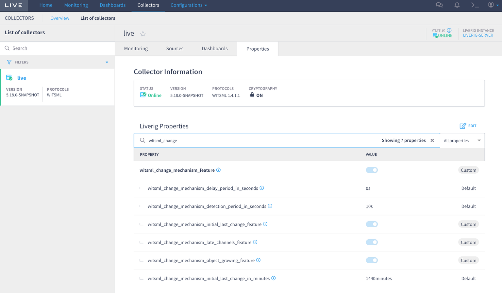
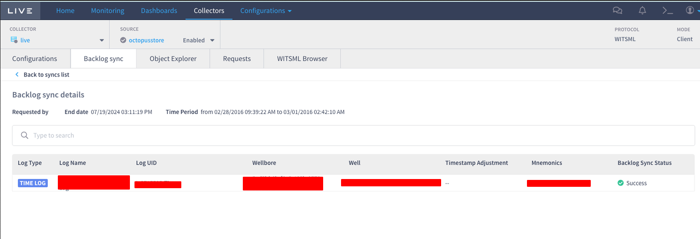

# Liverig 5.18.0 - Features and improvements

## Allow Liverig to Collect specific channels which arrive with low-frequency Samples

### Brief

Sometimes there are some scenarios that we need to collect data from channels which are transmitted with a _timestamp_ in the past "_late channels_"

Liverig works by sending a request to the Store for the available data points AFTER the last maximum timestamp it received. Therefore, in scenarios like this, most of the time Liverig will not collect the “late channel”.

To solve this problem we added new parameters that is a complement of the _WITSML change mechanism feature_ released in [Liverig version 5.17.0](liverig-5.17.0-feat-and-improvements.md)

### How it works

The _Witsml Change Mechanism Feature_ is a lightweight way to request object changes. 

This feature will:

* request queries using _dTimLastChange_ filter to detect new object changes and do new requests for each changed object

* request queries using the _objectGrowing_ filter to detect changes when _dTimLastChange_ didn’t respond with new objects.

* will create an automatic backlog history for each _mnemonic_ when new changes in _logCurveInfo_ min/max indexes are changed

* use the original request way without using the original pooling based on _query_period_

* work with all previous WITSML objects collected in the collector.

* replace the real-time object polling requests in the collector

* reduce unnecessary pooling using the old way.

### Properties to configure: (released in [Liverig version 5.17.0](liverig-5.17.0-feat-and-improvements.md))

* `witsml_change_mechanism_feature` - Enables a mechanism for identifying change for data objects in a WITSML server

* `witsml_change_mechanism_detection_period_in_seconds` - The number of seconds for the client to detect a change in  an object

* `witsml_change_mechanism_delay_period_in_seconds` - The number of seconds for the client delayed to start

* `witsml_change_mechanism_initial_last_change_feature` - Enables the use of a default initial last change date when starts the feature

* `witsml_change_mechanism_initial_last_change_in_minutes` - The number of minutes before now for use as the default last change for an initial request

### New properties added in this version:

* `witsml_change_mechanism_late_channels_feature` - Allows to collect channels that arrive with low-frequency samples. This feature enables the automatic backlog history request for mnemonics with late data that arrived after the last real-time data were collected. The main idea is to reduce a real necessity of creating manual backlog history when this data is missing in Live.

* `witsml_change_mechanism_object_growing_feature` - Enables the use of object-growing queries when there aren't changed objects(using dTimLastChange in requested queries). Object Growing is available for log, mudLog, and trajectory objects only

New automatic backlog history requests, will be shown in the Backlog History Request Screen when the _witsml_change_mechanism_feature_ property is enabled (and _witsml_change_mechanism_late_channels_feature_ too). This feature will create a new backlog history for each mnemonic.

